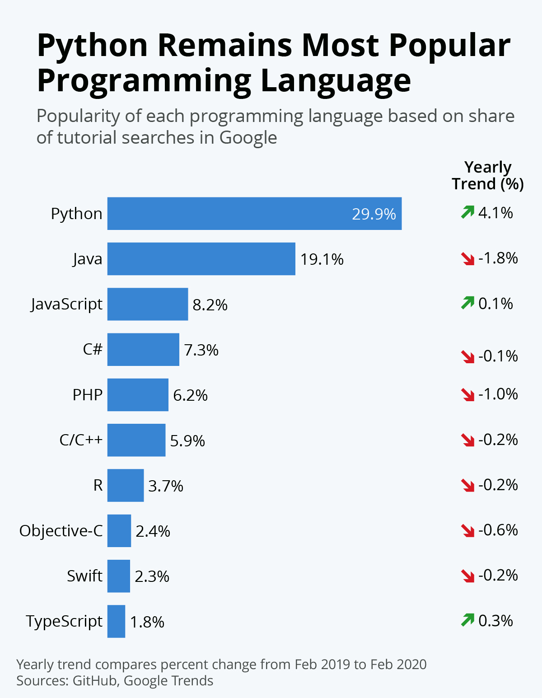

## Why Python?
- **Easy to Read and Learn:** 
  - Python's syntax is clear and intuitive, 
  - English-like - ideal language for beginners.
- **Versatile:** 
  - From web development to data science, Python's applications are vast.
- **Strong Community Support:** 
  - A robust and active community means abundant resources and libraries.
- **Efficient Development:** 
  - Python's frameworks and libraries simplify and speed up the development process.
- **Popular**
>  .

  
- **Automation:**
  - **Scripting Daily Tasks:** 
    - Automating routine tasks like file organization, sending emails, or data entry.
    - _Google_ uses automated scripts written in Python to crawl the web and indexing pages for the Google Search engine.
  - **Web Scraping:** 
    - Extracting data from websites using libraries like BeautifulSoup etc.
    - _BuzzFeed_ has used Python for scraping web data to gather information for their news stories.
  - **Automated Testing:** 
    - Writing scripts for automated testing of software applications with frameworks like pytest.
    - _Netflix_ uses Python for automated testing of their application, ensuring reliability and performance.

- **Web and Application Development:**
  - **Web Frameworks:** 
    - Creating web applications using frameworks like Django and Flask.
    - _Pinterest_ uses Django, a Python framework, for website development.
  - **Microservices:** 
    - Developing microservices architectures with Flask or FastAPI.
    - _Uber_ employs Python to develop various microservices that power its complex transportation platform.
  - **API Development:** 
    - Building RESTful APIs for web services.
    - _Stripe_ uses Python for building powerful and efficient APIs for online payment processing.

- **Data Analysis and Visualization:**
    - **Data Wrangling:** 
      - Manipulating and preparing data using Pandas.
      - _The New York Times_ uses Python, particularly Pandas, for data analysis and journalistic research.
    - **Data Visualization:** 
      - Creating visual data representations with tools like Matplotlib and Seaborn.
      - _The Jet Propulsion Laboratory (NASA)_ uses Python for visualizing data from space missions.
    - **Statistical Analysis:** 
      - Performing statistical analysis and modeling with SciPy and NumPy.
      - The financial sector, including companies like _JPMorgan Chase_, utilizes Python for complex financial modeling and risk management.

- **AI and Machine Learning:**
  - **Predictive Analytics:** 
    - Using libraries like scikit-learn for predictive modeling and data analysis.
    - _Amazon_ uses Python for customer segmentation and predicting future purchase patterns to enhance its recommendation system.
  - **Natural Language Processing (NLP):** 
    - Developing applications in NLP using libraries like NLTK(Natural Language Toolkit) and spaCy.
    - _Twitter_ leverages Python for analyzing and interpreting tweets to enhance user engagement and ad targeting.
  - **Neural Networks:** 
    - Building and training neural networks with TensorFlow or PyTorch for applications like image and speech recognition.
    - _Google DeepMind_ utilizes Python for developing neural networks in projects like AlphaGo.

  
- **Famous Examples:**
    - **Instagram:** Utilizing Django (a high-level Python web framework) to handle vast amounts of user data and interactions.
    - **Dropbox:** Built with Python to manage file storage and synchronization services.
    - **Spotify:** Leveraging Python for backend services and data analysis to enhance user experience and music recommendations.

## Course Overview:
- This Python programming course is designed for beginners, aiming at providing in-depth programming skills for a variety of job roles.
- The duration of the course is **30 days**, with daily **1-hour** sessions.
- The curriculum is divided into six weeks, each exploring a different aspects of Python programming.
    - **Week 1:** Introduction and Basics
    - **Week 2:** Data Structures and Functions
    - **Week 3:** Intermediate Concepts and Debugging
    - **Week 4:** Object-Oriented Programming
    - **Week 5:** Advanced Topics and Introduction to Testing
    - **Week 6:** Introduction to Django & Development of Mini Project

- <b>[Detailed Course Structure](course.md)</b>

## Daily Session Breakdown:
This Python programming course is meticulously designed to ensure a balanced learning experience. Each 1-hour session is strategically divided to maximize learning and interaction.
1. **Initial 10 Minutes** - Discussion on the previous day assignments
2. **Main 40 Minutes** - Core Learning for the day
3. **Final 10 Minutes** - QnA and next day assignment discussion

## Collaboration Tools:
1. **Course Material Distribution via GitHub:**
    - GitHub will be our primary platform for sharing course materials. 
    - After each session, I will upload the day's materials to GitHub.
    - You can access these materials any time [GitHub - Python Course](https://github.com/ranjanzyx/ranjan-python-course).
2. **Utilizing Slack for Peer-to-Peer Interaction:**
    - Our designated Slack group will act as a self-help community. 
    - We can post queries, engage in discussions, and assist each other with challenges. 
3. **Google Colab for Practical Data Science Exploration:**
    - As we progress to the data science modules of our course, we will start using [Google Colab](https://colab.google/). 
    - This platform allows for hands-on experimentation in a cloud-based environment. 
    - This is ideal for practicing data science concepts without the need for complex setup or high-end hardware.

## Support and Community:
- [Python.org Community Forums](https://www.python.org/community/forums/): The official community forum for Python enthusiasts to discuss topics and share knowledge Python.org Forums.
- [PySlackers](https://pyslackers.com/web): An inclusive community of Python programming enthusiasts with resources available mainly on Slack PySlackers.
- [Stack Overflow](https://stackoverflow.com/questions/tagged/python): The official community of StackOverflow for python queries
