## Day 1: Python and PyCharm Installation

## Python Installation
- Before you begin, you should check if Python is already installed on your computer. 
- If Python 3.9 or a higher version is already installed, there is no need to reinstall it. 
- You can follow these steps to determine your Python version and install Python 3.12 if needed.

#### Step 1: Check Current Python Version
- Open a **Terminal (on macOS)** or **Command Prompt (on Windows)** on your computer. 
- You can do this by searching for "Terminal" (macOS) or "cmd" (Windows)
- In the Terminal or Command Prompt, type the following command `python --version` and press Enter:
- This command will display the current version of Python installed on your system.
- 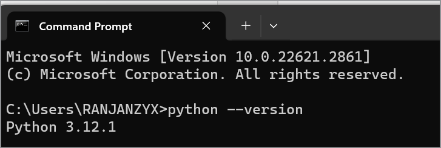

#### Step 2: Verify the Python Version
- If the version is **3.9 or higher** (e.g., 3.9.7, 3.10.3, etc.), Python is already installed.
- You can use it without any further action. Skip to the section on installing PyCharm.

#### Step 3: Install Python 3.12 (If Needed)
- If the Python version displayed in step 2 is lower than 3.9 or if Python is not installed at all, you'll need to install Python 3.12. 

### Download and Install Python (Windows)
- Download **Python 3.12** from https://www.python.org/downloads/
- Make sure to select **"Add python.exe to PATH"**
- 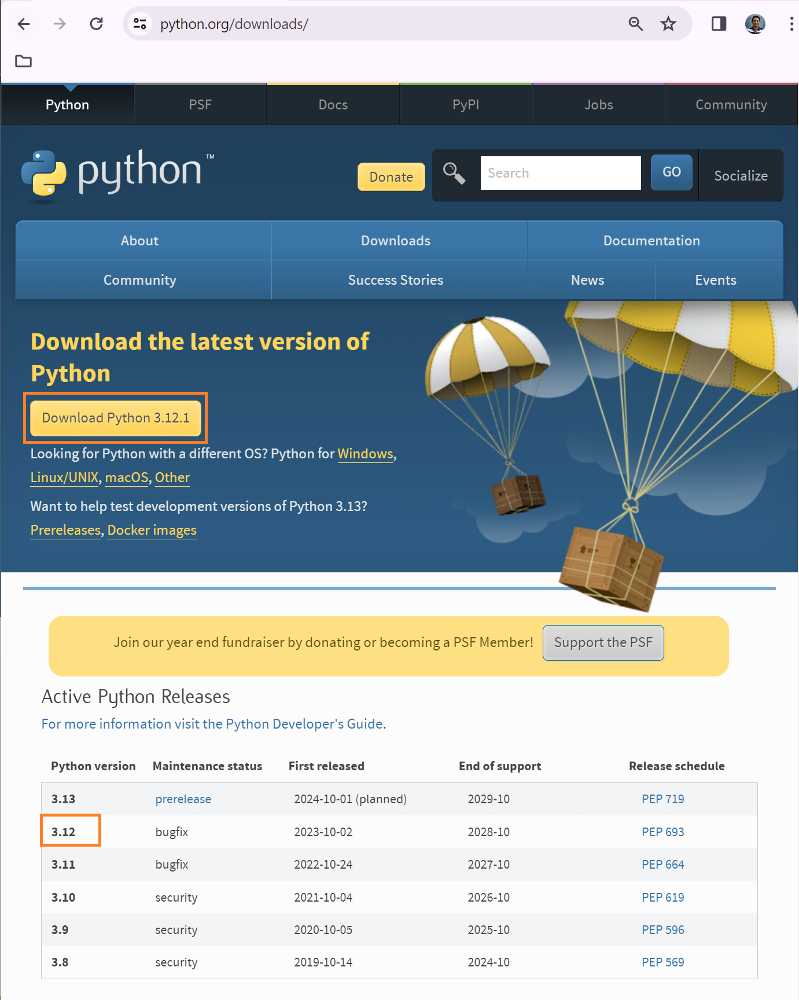
- 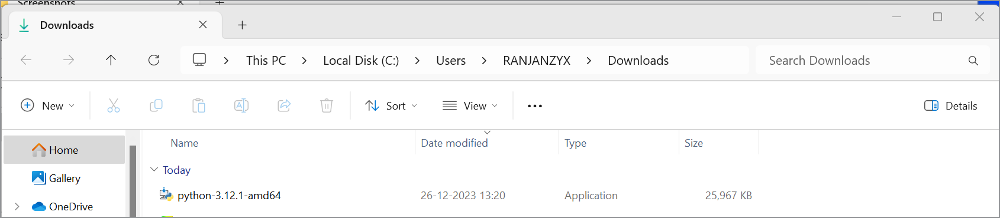
- 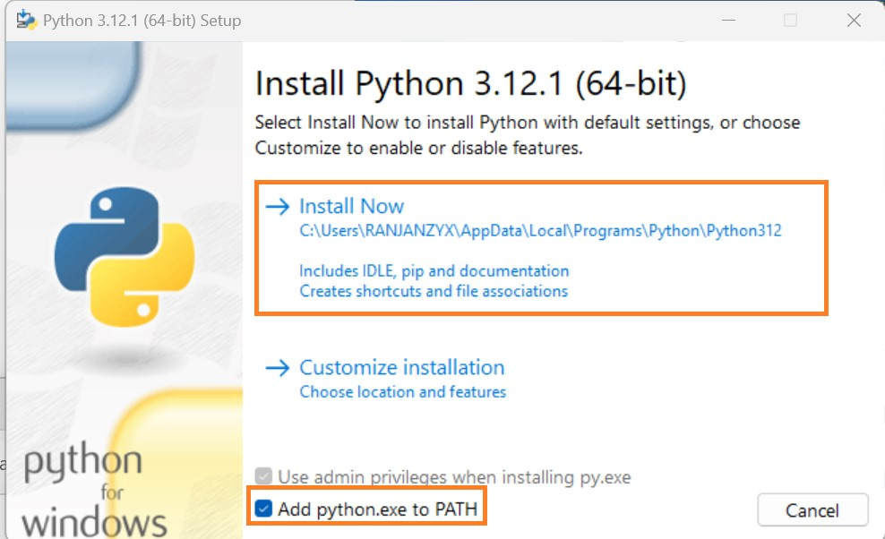

### Download and Install Python (MacOS)
- Download **Python 3.12** from https://www.python.org/downloads/
- Once the download is complete, locate the downloaded file (typically in your "Downloads" folder) and double-click it to run the installer.
- Follow the on-screen instructions to install Python 3.12. 
- Make sure to check the box that says "Add Python 3.12 to PATH" during the installation process. 
- 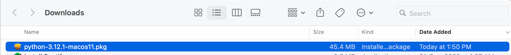
- 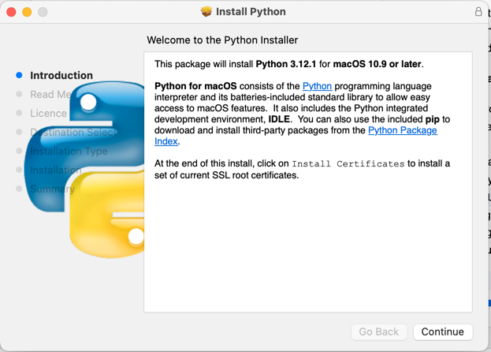
- 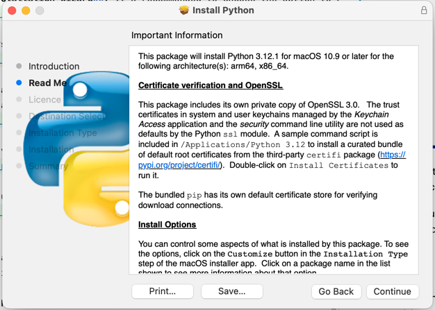
- 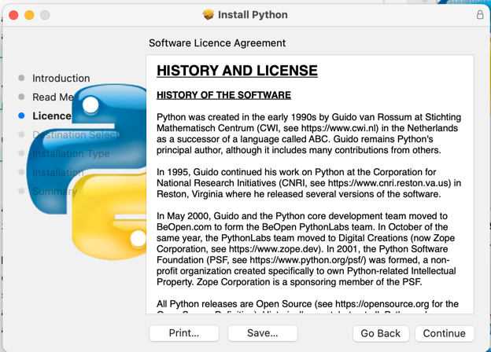
- 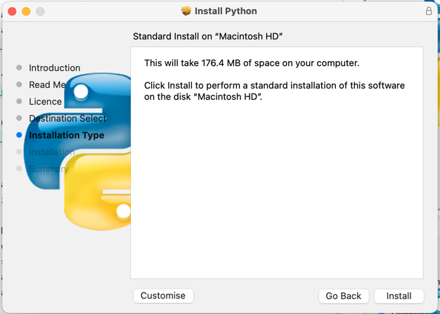
- 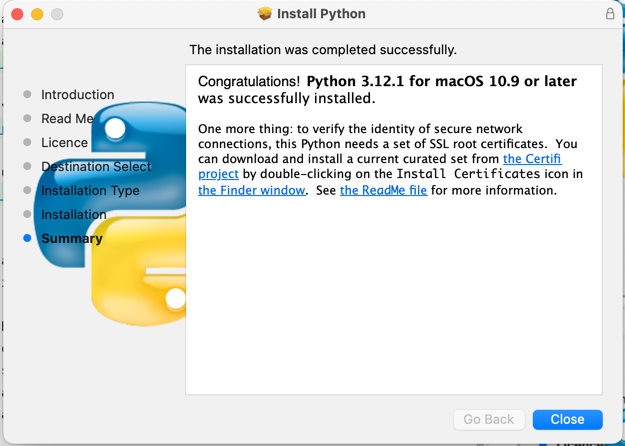

## Verify Python Installation
1. Open command prompt on windows (or terminal on mac)
2. Type `python --version` or `python -V`
3. You should see the version of python installed
4. Type `python`
5. You should see the python prompt
6. Type `print("Hello World")`
7. Type `exit()` to exit the python prompt
- 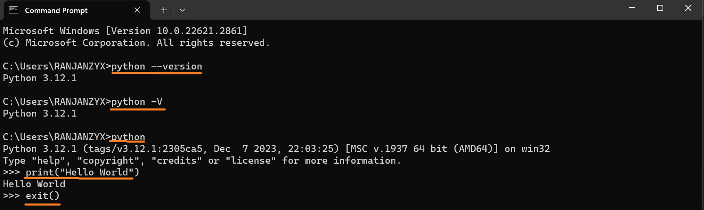
---
## GitHub Account Creation
- GitHub will be our primary platform for sharing course materials. 
- After each session, I will upload the day's materials to GitHub.
- You can access these materials any time [GitHub - Python Course](https://github.com/ranjanzyx/ranjan-python-course)
- Open "https://github.com" in browser and follow the on-screen instructions to complete the signup process

---
## Pycharm Installation
- PyCharm is a widely used IDE for Python development. 
- The Community Edition is free and open-source, suitable for Python development.

### Download and install pycharm (Windows)
- Download PyCharm from https://www.jetbrains.com/pycharm/download/other.html > choose the version as highlighted in the image below.
- Once the file is downloaded, double-click on the downloaded file to run it
- Follow the installation wizard. 
- It’s recommended to choose the option to create associations with .py files and to add PyCharm to the PATH.
- **Reboot the system** if asked  
- 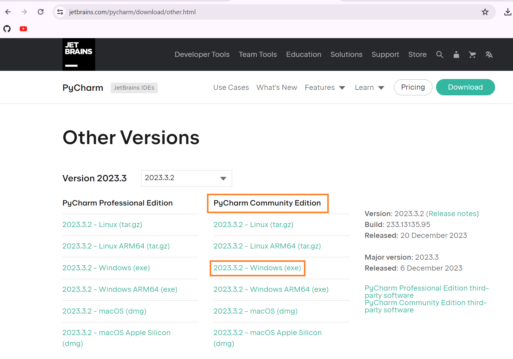
- 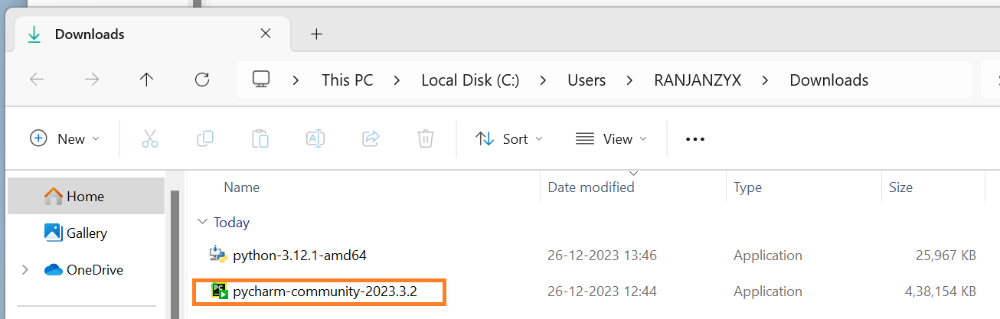
- 
- 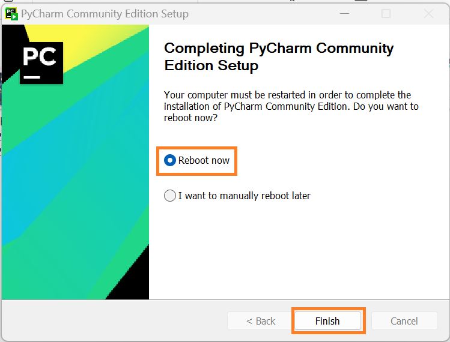

### Download and install pycharm (MacOS)
- 
- 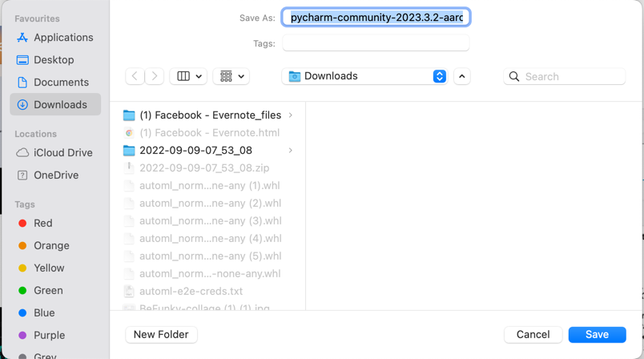
- 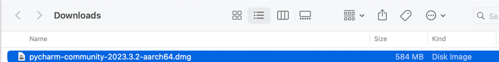
- 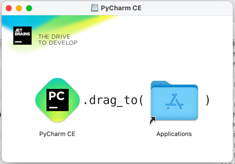

**Open PyCharm and Clone the Course Repository:**
- Launch PyCharm and select "Get from VCS" (Version Control System).
- Clone repository to your local machine. **URL: https://github.com/ranjanzyx/ranjan-python-course.git**
- You should be able to see the course files in the project window
- 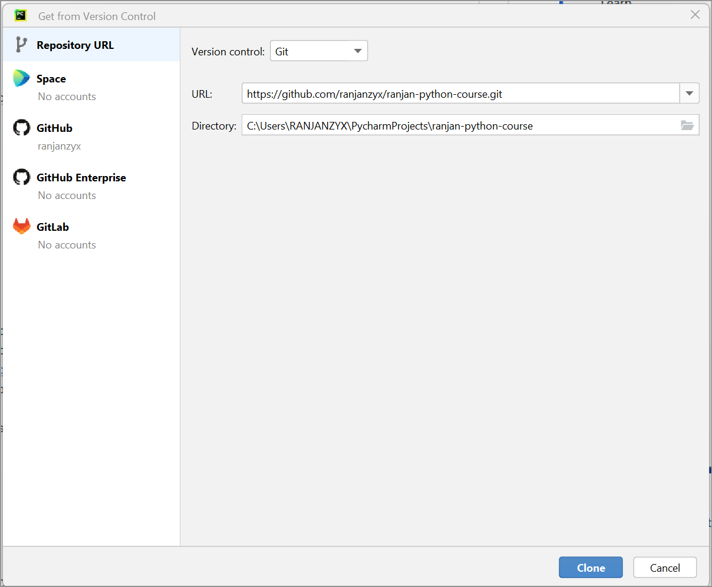
- 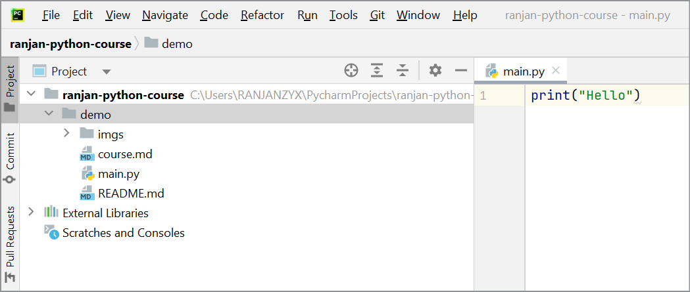
**Note:** 
- We will have a dedicated session on Git in the future to delve deeper into its functionalities. 
- For now, cloning this repository will ensure that we are all synchronized with the course materials and exercises.

**Exploring PyCharm:**
- Familiarize yourself with the PyCharm interface. 
- The main areas are the editor window, the project view, and the toolbar.
- Try creating a new Python file: Right-click on the project directory → New → Python File. Write a simple program, like `print("Hello, PyCharm!")` and save it as `main.py`.
- Run the program by right-clicking on the file in the project view and selecting `Run`
