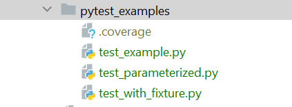

# Introduction to Testing
- Testing is an integral part of the software development process 
- It ensures that software products are reliable, perform as expected, and provide a quality experience for the end-users.
- By identifying defects and inconsistencies early, testing helps maintain high standards of code quality throughout the development lifecycle.

## Overview of Testing Types
### 1. Unit Tests
- **Definition:** 
  - Unit tests are designed to verify the functionality of a specific section of code, usually at the function or method level.
  - By testing these small parts in isolation, developers can ensure that each piece performs as expected.
- **Advantages:**
  - Quick to execute, making them ideal for frequent testing during development.
  - Helps in identifying and isolating specific faults within the codebase.
  - Facilitates test-driven development (TDD) practices.
- **Use Case:** 
  - Unit tests are particularly useful for testing complex algorithms, data transformations, and business logic where individual components need to behave predictably.

### 2. Integration Tests
- **Definition:** 
  - Integration tests focus on the interactions between different modules or external systems and services to ensure they work together correctly. 
  - This can include testing APIs, client-server interactions, and the integration between different software components.
- **Advantages:**
  - Validates the **interoperability and cohesiveness** of the software components.
  - Helps in identifying issues related to data flow, API contracts, and external dependencies**.
  - Essential for ensuring that the system works as a whole and meets the integrated functional requirements.
- **Use Case:** 
  - Integration tests are crucial when a software application relies on external services (like databases, web services, or third-party APIs) or when components developed by different teams must work together seamlessly.

### Assertions: The assert Statement
- The `assert` statement is used to test if a condition in your program is True. 
- If the condition is True, the program does nothing and moves to the next line of code. 
- However, if the condition is False, an `AssertionError` exception is raised, optionally printing a specified error message.
- Syntax: `assert condition, "Optional error message"`

- Example:
```python
x = 1
assert x == 1, "x is not 1"
assert x > 2, "x is not greater than 2"  # This will raise an AssertionError
# Getting Started with Python Testing
```

## `unittest`
- Built-in unit testing framework in Python (since version 2.1)
- Designed for testing individual units of code (functions, classes, modules)
- Facilitates test automation, setup/teardown actions, flexible test case organization, and independence from reporting frameworks

### Structure:
`unittest.TestCase`: Base class for creating test cases (methods start with `test_`)
- **Assertions:** Functions like assertEqual, assertTrue, assertRaises to verify expected behavior
  - `unittest.TestSuite`: Groups test cases and suites for organized execution
  - `unittest.TestProgram`: Command-line test runner (usually executed as python -m unittest)
    - `assertEqual(a, b)`: Check if a equals b.
    - `assertTrue(x)`: Check if x is True.
    - `assertFalse(x)`: Check if x is False.
    - `assertRaises(Exception, func, *args, **kwargs)`: Check that an exception is raised when func is called with the specified arguments.

### Assertions in unittest
- The `unittest` module in Python is used for automated testing. 
- It provides a rich set of assertion methods that allow you to check a wide variety of conditions in your tests.
- Some common unittest assertion methods include:
  - **assertEqual(a, b):** Checks that a == b.
  - **assertNotEqual(a, b):** Checks that a != b.
  - **assertTrue(x):** Checks that bool(x) is True.
  - **assertFalse(x):** Checks that bool(x) is False.
  - **assertIs(a, b):** Checks that a is b.
  - **assertIsNone(x):** Checks that x is None.
  - **assertIn(a, b):** Checks that a in b.
  - **assertRaises(exception, callable, args, kwargs):** Checks that a specified exception is raised when callable is called with any arguments and keyword arguments.

```python
import unittest

def divide(x, y):
    """Function to divide x by y"""
    if y == 0:
        raise ValueError("Cannot divide by zero.")
    return x / y


class TestAssertions(unittest.TestCase):
    def test_assertEqual(self):
        self.assertEqual(10, 10, "10 is not equal to 10")

    def test_assertNotEqual(self):
        self.assertNotEqual(10, 5, "10 is equal to 5")

    def test_assertTrue(self):
        self.assertTrue(10 > 5, "10 is not greater than 5")

    def test_assertFalse(self):
        self.assertFalse(10 < 5, "10 is less than 5")

    def test_assertIs(self):
        a = 'some_string'
        b = 'some_string'
        self.assertIs(a, b, "a is not b")

    def test_assertIsNone(self):
        self.assertIsNone(None, "Value is not None")

    def test_assertIn(self):
        self.assertIn(3, [1, 2, 3], "3 is not in the list")

    def test_assertRaises(self):
        with self.assertRaises(ValueError, msg="Did not raise ValueError"):
            divide(10, 0)

    def test_divide_normal_condition(self):
        self.assertEqual(divide(10, 2), 5)

    def test_divide_by_zero_raises_value_error(self):
        with self.assertRaises(ValueError, msg="Did not raise ValueError"):
            divide(10, 0)


if __name__ == '__main__':
    unittest.main()
```

```python
# math_utils.py

def add(a, b):
    """Adds two numbers."""
    return a + b

def subtract(a, b):
    """Subtracts one number from another."""
    return a - b

# Other math functions as needed
```

```python
# test_math_utils.py

import unittest
from math_utils import add, subtract

class MyMathTest(unittest.TestCase):

    def test_add_positive(self):
        """Tests the addition of positive numbers."""
        result = add(2, 3)
        self.assertEqual(result, 50, "Adding 2 and 3 should return 5")

    def test_add_negative(self):
        """Tests the addition of negative numbers."""
        result = add(-2, 1)
        self.assertEqual(result, -1, "Adding -2 and 1 should return -1")

    def test_subtract_positive(self):
        """Tests the subtraction of positive numbers."""
        result = subtract(8, 4)
        self.assertEqual(result, 4, "Subtracting 4 from 8 should return 4")

    def test_subtract_negative(self):
        """Tests the subtraction of negative numbers."""
        result = subtract(-2, 1)
        self.assertEqual(result, -3, "Subtracting 1 from -2 should return -3")

if __name__ == "__main__":
    unittest.main()
```


## `pytest`
`pip install pytest`
- pytest is a mature full-featured Python testing tool that helps you write better programs. 
- It is a framework that makes building simple and scalable test cases easier. 
- pytest supports testing of all layers of your application - from unit to functional testing. 
- With its simple syntax, pytest allows for compact test suites as well as more readable and maintainable test code.

### Advantages Over unittest
- pytest offers several advantages over Python's standard library unittest module, making it popular among developers:
  - **Simpler Syntax:** 
    - pytest uses a simpler, more intuitive syntax for writing tests. 
    - There is no need to create classes derived from `unittest.TestCase`, as pytest can use plain functions for test cases.
  - **Powerful Features:** 
    - It includes several powerful features out-of-the-box, such as 
      - automatic test discovery, 
      - assert introspection (providing clear error messages), and 
      - the ability to rerun from the last failing test.
  - **Extensive Plugin Ecosystem:** 
    - `pytest` can be extended with hundreds of plugins to customize and enhance its functionality. 
    - This ecosystem allows it to integrate smoothly with many different tools and frameworks.
  - **Fixture Management:** 
    - It offers a flexible fixture system for setting up and tearing down test environments or objects automatically.
  - **Parameterized Testing:** 
    - `pytest` supports parameterized testing, making it easy to run a test function with different sets of data.

### Writing pytest Test Cases
Writing test cases in pytest is straightforward:
- **Test Functions:** 
  - Each test is defined in a function prefixed with `test_`. 
  - pytest automatically discovers these functions in your test files.
- **Assertions:** 
  - Use the built-in `assert` statement for asserting test conditions. 
  - `pytest` provides detailed context for assert failures, making debugging easier.
- **Convention Over Configuration:** 
  - pytest follows this principle, requiring minimal configuration to get started. 
  - Test discovery is based on conventions, such as test file names (e.g., test_*.py).

```python
# test_example.py
# python -m pytest test_example.py

# A simple function to test
def add(a, b):
    return a + b

# A test function to check the add function
def test_add():
    assert add(2, 3) == 5  # Assert that 2 + 3 equals 5
    assert add('a', 'b') == 'abc'  # Testing string concatenation
```

### Fixtures
- Fixtures in pytest are a powerful feature for setting up and tearing down the test environment or objects before and after the tests run. 
- They are reusable components that can be applied to multiple test functions:

- **Define Fixtures:** 
  - Use the `@pytest.fixture` decorator to define a fixture function. 
  - This function can perform any setup tasks and return data or objects needed by the tests.
- **Use Fixtures:** 
  - Specify fixtures as arguments in your test functions. pytest automatically injects the appropriate fixture values.
- **Scope and Autouse:** 
  - Fixtures can be scoped (session, module, class, or function) to control their lifecycle. 
  - They can also be set to autouse, automatically applying them to all tests without explicit declaration.
```python
# test_with_fixture.py
# python -m pytest test_with_fixture.py

import pytest

# Define a fixture that sets up data before a test and cleans up after
@pytest.fixture
def sample_data():
    data = {'key': 'value'}
    # Setup before yield
    yield data
    # Teardown after yield
    data.clear()

# Use the fixture in a test by specifying its name as an argument
def test_data(sample_data):
    assert sample_data['key'] == 'value'  # Use the fixture data
```

### **Parameterized Tests**
  - Parameterized tests allow you to run the same test function with different sets of data, enhancing test coverage with minimal code duplication:
  - Use the `@pytest.mark.parametrize` decorator to specify a list of values or parameters. 
  - `pytest` will run the test function once for each set of parameters, making it easy to test various input combinations and edge cases.
```python
# test_parameterized.py
# python -m pytest test_parameterized.py

import pytest


def add(a, b):
    return a + b


@pytest.mark.parametrize("a,b,expected", [
    (1, 2, 3),
    (2, 3, 5),
    ('Hello ', 'World', 'Hello World'),
])
def test_add(a, b, expected):
    assert add(a, b) == expected
```
### pytest-cov:
pytest-cov: 
  - This plugin generates test coverage reports, helping you understand which parts of your code are not being tested.



Generate text report: `python -m pytest --cov .`

Generate html report: `python -m pytest --cov=. --cov-report html`

```
C:\whatever\ranjanzyx_repos\python\day24_testing_unittest_pytest\pytest_examples>python -m pytest --cov .
==========================================================================================================
platform win32 -- Python 3.7.9, pytest-7.4.4, pluggy-1.2.0
rootdir: C:\whatever\ranjanzyx_repos\python\day24_testing_unittest_pytest\pytest_examples
plugins: cov-4.1.0
collected 5 items                                                                                                                                                                                                                                                                                                       

test_example.py .                                                                                                                                                                                                                                                                                                [ 20%] 
test_parameterized.py ...                                                                                                                                                                                                                                                                                        [ 80%] 
test_with_fixture.py .                                                                                                                                                                                                                                                                                           [100%] 

----------- coverage: platform win32, python 3.7.9-final-0 -----------
Name                    Stmts   Miss  Cover
-------------------------------------------
test_example.py             5      0   100%
test_parameterized.py       5      0   100%
test_with_fixture.py        7      0   100%
-------------------------------------------
TOTAL                      17      0   100%
========================================================================================================== 
```
- **Stmts:** The number of lines of code in the test files.
- **Miss:** The number of lines of code that were not executed by the tests.
- **Cover:** The percentage of code that was executed by the tests.
In the example above, each test file has a 100% coverage rate, meaning all lines of code in those files were executed during testing.

 