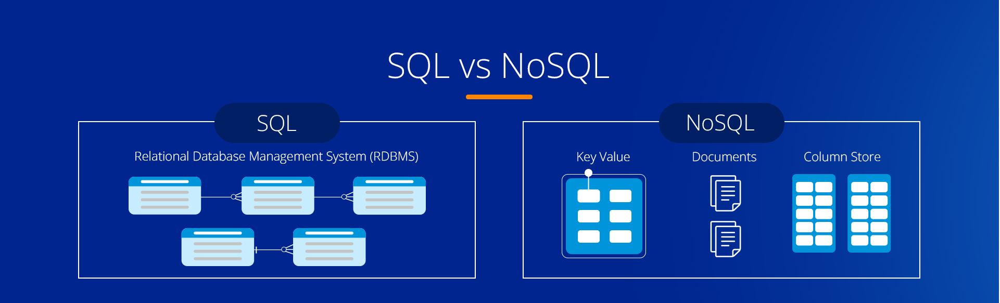

# Databases
- Databases play a pivotal role in today's digital world, providing the backbone for storing, managing, and retrieving vast amounts of data efficiently. 
- They are fundamental to various applications, from simple websites to complex data analytics platforms.
- Understanding the different types of databases and their unique characteristics is crucial for selecting the right database for specific needs. 
- Here's a detailed overview of the primary types of databases: 
  - Relational, 
  - NoSQL, and 
  - In-Memory databases.

## What are Database Transactions ?
- A transaction is a sequence of one or more SQL operations that are treated as a single logical unit of work. 
- Transactions have the following key properties, often referred to by the acronym ACID:

1. **Atomicity:** 
   - This property ensures that each transaction is treated as a single "unit", which either succeeds completely or fails completely. 
   - If any part of the transaction fails, the entire transaction fails and the database state is left unchanged. 
   - Essentially, atomicity guarantees that each transaction is indivisible and irreducible.
2. **Consistency:** 
   - Consistency ensures that a transaction can only bring the database from one valid state to another, maintaining database invariants or rules. 
   - This means that any data written to the database must be valid according to all defined rules, including constraints, cascades, triggers, and any combination thereof. 
   - If a transaction results in a breach of consistency, the entire transaction is rolled back and the database is left unchanged.
3. **Isolation:** 
   - The main goal of isolation is to ensure that the concurrent execution of transactions leaves the database in the same state that would have been obtained if the transactions were executed serially. 
   - This means that transactions are isolated from each other, hiding the effects of concurrently executed transactions. 
   - Isolation is typically implemented using locks that can block other transactions from accessing the same data simultaneously. 
4. **Durability:** 
   - Durability guarantees that once a transaction has been committed, it will remain so, even in the event of power loss, crashes, or errors. 
   - In essence, once the transaction is done, the changes made by the transaction are permanent and must not be lost due to system failure. 
   - This is usually achieved by storing transaction logs in non-volatile memory.

## Relational Databases
- Relational databases, also known as RDBMS (Relational Database Management Systems), store data in structured formats using tables. 
- These tables are made up of rows and columns, where each row represents a record and each column represents a data field. 
- This structure allows for the establishment of relationships between tables using keys, which can be used to link data across tables.

Key Features:
- **Structured Query Language (SQL):** 
  - Relational databases use SQL, a powerful and standardized language, for querying and manipulating data.
  - SQL allows for complex queries, transactions, and operations with data integrity and atomicity.
- **ACID Properties:** 
  - They adhere to ACID (Atomicity, Consistency, Isolation, Durability) properties, ensuring reliable transaction processing and data integrity.
- **Schema-on-Write:** 
  - Relational databases require defining the schema (structure of the database) before data insertion. 
  - This ensures data consistency but requires upfront design and can be less flexible for rapidly evolving data models.
- **Popular Examples:** 
  - SQLite, 
  - PostgreSQL, 
  - MySQL.
- **Use Cases:** 
  - Ideal for applications requiring complex transactions, data integrity, and relationships among data, such as financial systems, customer relationship management (CRM) systems, and enterprise resource planning (ERP) systems.

## NoSQL Databases
- NoSQL databases were developed to address the limitations of relational databases, particularly concerning scalability, flexibility, and the ability to handle unstructured and semi-structured data. 
- NoSQL databases do not require a fixed schema, allowing for more flexibility in storing diverse data types.

**Key Features:**
- **Schema-less:** NoSQL databases allow for the storage of data without a predefined schema, making it easier to adapt to changes in data structure.
- **Scalability:** They are designed to scale out using distributed architecture, making them suitable for handling large volumes of data across many servers.
- **Types of NoSQL Databases:**
  - **Document-oriented:** 
    - Store data in document formats (e.g., JSON, BSON). 
    - Ideal for storing, retrieving, and managing document-oriented information. (Example: MongoDB)
  - **Key-Value:** 
    - Simple, yet powerful, storing data as a collection of key-value pairs. 
    - Suitable for caching and storing session information. (Example: Redis)
  - **Wide-Column:** 
    - Store data in tables, rows, and dynamic columns. 
    - Efficient for querying large datasets. (Example: Cassandra)
  - **Graph:** 
    - Designed for data that is interconnected and best represented as a graph. 
    - Suitable for social networks, recommendation engines, and fraud detection. (Example: Neo4j)
- **Use Cases:** NoSQL databases are well-suited for 
  - big data applications, 
  - real-time web applications, and 
  - when working with semi-structured or unstructured data.

## In-Memory Databases
- In-memory databases **store data in the main memory (RAM) rather than on disk** 
- This significantly speeds up data access times. 
- They are designed for applications requiring fast data retrieval, high throughput, and low-latency access.
- **Key Features:**
  - **Speed:** Accessing data in memory eliminates disk I/O, allowing for faster data processing and retrieval.
  - **Volatility:** Data is primarily stored in RAM, which can be volatile. Persistence mechanisms are used to prevent data loss.
  - **Use Cases:** 
    - caching, 
    - session storage, 
    - real-time analytics, and 
    - applications requiring immediate data access.
  - **Popular Examples:** 
    - Redis, 
    - Memcached

    
## SQL
- SQL (Structured Query Language) is the standard language used to communicate with relational database management systems (RDBMS). 
- It's designed for managing and manipulating relational databases. 
- SQL is powerful, allowing you to perform a wide range of operations on data stored in a database. 
- Below, we'll explore the basics of SQL, including syntax for CRUD operations, data filtering, sorting, aggregation, and understanding joins.

## Basic Syntax and CRUD Operations
- CRUD operations stand for 
  - Create 
  - Read
  - Update 
  - Delete 

## Create (C)
- To insert new table into a database, you use the `CREATE` statement.
- Creating the Books Table
```sql
CREATE TABLE Books (
    BookID INT PRIMARY KEY,
    Title VARCHAR(255),
    AuthorID INT,
    Genre VARCHAR(50),
    Price DECIMAL(10, 2),
    FOREIGN KEY (AuthorID) REFERENCES Authors(AuthorID)
);
```

- To insert new data into a database, you use the `INSERT INTO` statement.

```sql
INSERT INTO table_name (column1, column2, column3)
VALUES (value1, value2, value3);
```
```sql 
INSERT INTO Books (BookID, Title, AuthorID, Genre, Price)
VALUES (1, 'SQL for Beginners', 101, 'Education', 19.99);


INSERT INTO Books (BookID, Title, AuthorID, Genre, Price)
VALUES (2, 'Python for Beginners', 202, 'Education', 29.99);
```

## Read (R) 
To query data from a database, you use the `SELECT` statement. You can retrieve all columns with * or specify columns.
```sql
SELECT column1, column2 FROM table_name;  -- select specific cols
SELECT * FROM table_name;  -- select all cols
```
```sql 
SELECT * FROM Books;
``` 
```sql
SELECT Title, Price FROM Books
WHERE Genre = 'Education';
```
## Update (U)
To modify existing data, you use the UPDATE statement along with the SET clause to specify the new values and a WHERE clause to select which rows to update.
```sql
UPDATE table_name
SET column1 = value1, column2 = value2
WHERE condition;
```
```sql
UPDATE Books
SET Price = 24.99
WHERE Title = 'SQL for Beginners';
```

## Delete (D) 
To remove data from a table, the `DELETE` FROM statement is used, often with a WHERE clause to specify which rows should be removed.
```sql
DELETE FROM table_name WHERE condition;
```
```sql 
DELETE FROM Books WHERE BookID = 1;
```

## Data Filtering and Sorting
- **Filtering:** The `WHERE` clause is used to filter records that fulfill a specified condition.
```sql
SELECT * FROM table_name
WHERE condition;
```
```sql
SELECT * FROM Books WHERE Price > 25
```
- **Sorting:** The `ORDER BY` clause is used to sort the result set in ascending or descending order.
```sql
SELECT * FROM table_name ORDER BY column ASC|DESC;
```
```sql 
SELECT * FROM Books ORDER BY Price DESC;
```

# Python's Database API
- Python's Database API (DB-API) provides a consistent interface for interacting with relational database systems. 
- This standard allows Python applications to communicate with a wide variety of database servers using a unified API. 
- The key concepts of DB-API include connections, cursors, executing SQL queries, handling transaction control, and error handling. 
- Let's explore these concepts using your example of inserting records into a Books table.

## Connections
- A connection object represents a connection to a database. 
- It's the first step in interacting with a database server. 
- To establish a connection, you typically need to provide details such as the database server's hostname, a username, a password, and the database name you want to access.

- We will use SQLite database (a simple file-based database system) for this course:
- For other databases like PostgreSQL, MySQL, etc., you might use a connector library like psycopg2 or mysql-connector-python and provide a connection string or parameters.

- **Cursors**
  - Once connected, you use a cursor object to interact with the database. 
  - Cursors allow you to execute SQL commands through methods like `execute()` and fetch results from queries. 
  - A cursor is obtained from a connection object.
- **Executing SQL Queries**
  - With a cursor, you can execute SQL queries. 
  - The `execute()` method is used to run an SQL statement.
- **Transaction Control**
  - DB-API supports transaction control, allowing you to commit or rollback transactions. 
  - A transaction is a sequence of SQL commands treated as a single logical unit. 
  - If any command fails, the transaction can be rolled back to undo its effects.
  - After executing your SQL commands, you should `commit` the changes to make them permanent in the database:

```python
import sqlite3

try:
    # Create and connect to database
    conn = sqlite3.connect('bookstore.db')

    # Create a cursor
    cursor = conn.cursor()

    # SQL command to create a table
    create_table_command = """
    CREATE TABLE IF NOT EXISTS books (
        title VARCHAR(255),
        author VARCHAR(255),
        Price DECIMAL(10, 2)
    );
    """

    # Create table
    cursor.execute(create_table_command)

    # Inserting Data
    cursor.execute("INSERT INTO books (title, author, price) VALUES (?, ?, ?)", ('Book1', 'Ranjan', 100))
    cursor.execute("INSERT INTO books (title, author, price) VALUES (?, ?, ?)", ('Book2', 'Prabhakar', 200))
    conn.commit()

    # Querying Data
    cursor.execute('SELECT * FROM books')
    rows = cursor.fetchall()
    for row in rows:
        print(row)

    # Updating Data
    cursor.execute("UPDATE books SET price = ? WHERE title = ?", (150, 'Book1'))
    conn.commit()

    # Deleting Data
    cursor.execute("DELETE FROM books WHERE title = ?", ('Book1',))
    conn.commit()

    # Querying Data after deletion
    cursor.execute('SELECT * FROM books')
    rows = cursor.fetchall()
    for row in rows:
        print(row)

except sqlite3.Error as e:
    print(f"An error occurred: {e}")
finally:
    conn.close()
```

# Introduction to ORM and SQLAlchemy
- ORM (Object-Relational Mapping) is a technique that connects the rich objects of an application to database tables. 
- It abstracts the direct use of SQL in manipulating the database by providing a more Pythonic way of handling data. 
- This means you can work with classes and objects that mirror your database tables and columns.

- SQLAlchemy is a powerful library in Python that implements ORM. 
- It offers two main pieces: 
  - **the Core** (for working with schema and performing SQL operations) and 
  - **the ORM** (for working with high-level object-oriented operations). 
- It supports a wide range of databases, including SQLite, which makes it a versatile choice for many projects.

## Using SQLite with SQLAlchemy

- Setting Up SQLAlchemy
  - First, define your database model by extending the base class provided by SQLAlchemy's ORM.
```python
from sqlalchemy import create_engine, Column, String, Numeric, Integer
from sqlalchemy.orm import declarative_base, sessionmaker

Base = declarative_base()

Base = declarative_base()

class Book(Base):
    __tablename__ = 'books'
    id = Column(Integer, primary_key=True)
    title = Column(String(255))
    author = Column(String(255))
    price = Column(Numeric(10, 2))
# Creating Engine and Session

# Create an engine that stores data in the local directory's bookstore.db file.
engine = create_engine('sqlite:///bookstore.db')
# Create all tables in the engine
Base.metadata.create_all(engine)

# Create a sessionmaker, bound to our engine
Session = sessionmaker(bind=engine)
session = Session()
# Session Management
# A session in SQLAlchemy manages all the operations you perform on the database until you commit the transaction. 
# It works as a staging zone for all the objects loaded into the database session. 
# Changes made through the session won't be persisted in the database until you call session.commit().

# Performing CRUD Operations
# Create
book1 = Book(title='Book1', author='Ranjan', price=100)
session.add(book1)
session.commit()

# Read
books = session.query(Book).all()
for book in books:
    print(book.title, book.author, book.price)

# Update
book_to_update = session.query(Book).filter_by(title='Book1').first()
book_to_update.price = 150
session.commit()

# Delete
book_to_delete = session.query(Book).filter_by(title='Book1').first()
session.delete(book_to_delete)
session.commit()

# Querying Data
# SQLAlchemy provides a rich API for querying data. You can filter results, order them, join tables, and aggregate data. 

cheap_books = session.query(Book).filter(Book.price < 200).all()
for book in cheap_books:
    print(book.title, book.price)
```


