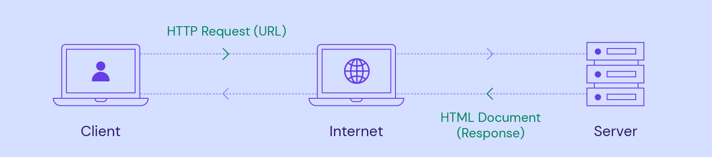
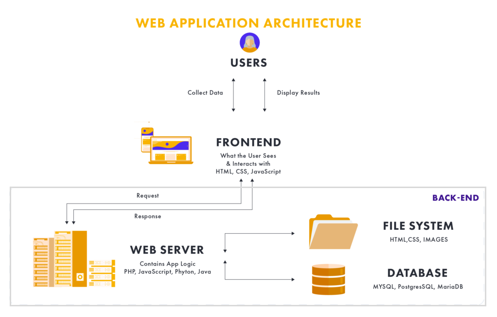
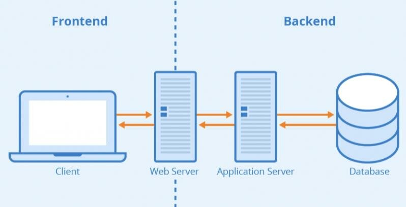
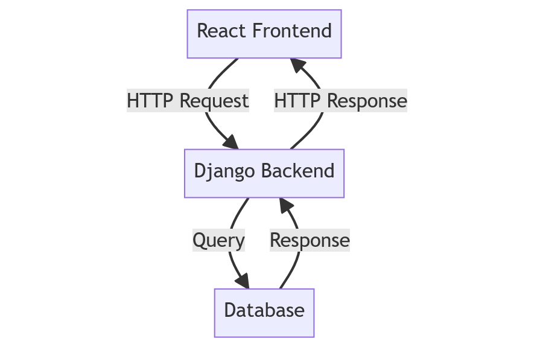
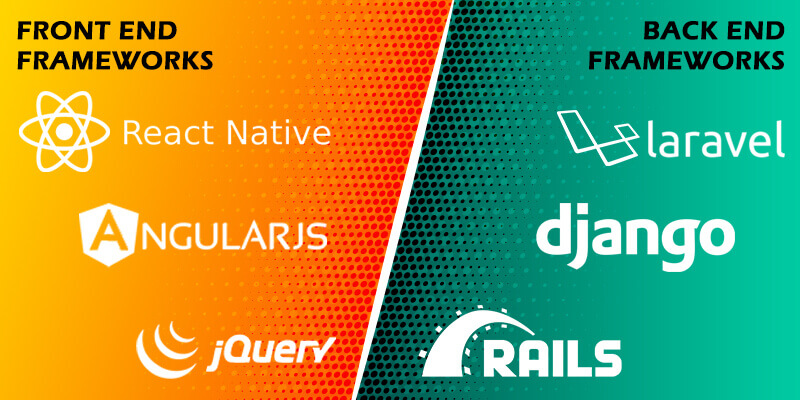
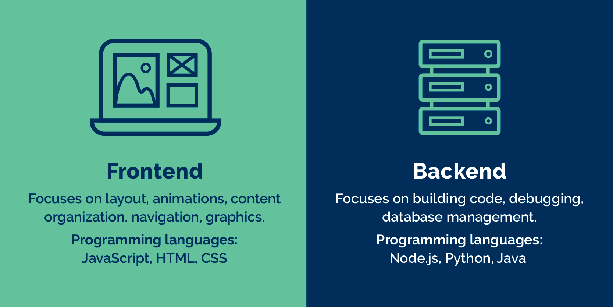
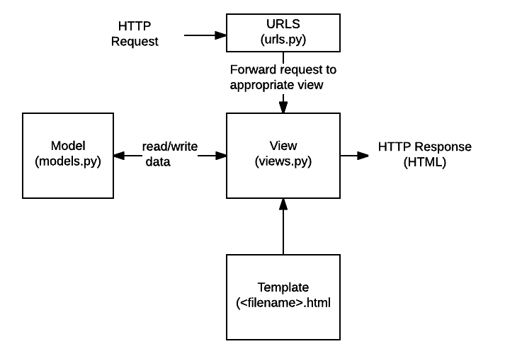
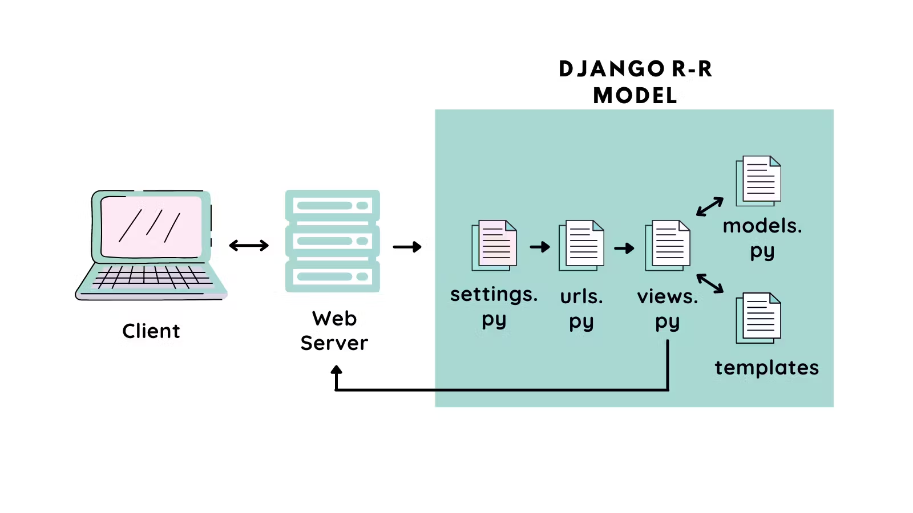

## Introduction to Web Development
- Web development is the process of building and maintaining websites.
- it's the work that happens behind the scenes to make a website look great, work fast, and offer a consistent user experience across different web browsers and devices.

## Basics of the Web

The web operates through a **client-server architecture**, a foundational concept that underpins much of the internet's functionality.
- **Servers**:
  - These are powerful computers that store and manage website resources, such as HTML files, CSS stylesheets, JavaScript files, and multimedia content. 
  - They are responsible for serving these resources upon request.
- **Clients** 
  - These are devices that users interact with to access web resources, such as computers, mobile phones, or tablets. 
  - The client runs a web browser (like Chrome, Firefox, Safari) which sends requests to servers to fetch web resources.
- **HTTP/HTTPS Protocols:** 
  - HTTP (Hypertext Transfer Protocol) and HTTPS (HTTP Secure) are protocols for transmitting hypermedia documents, such as HTML. 
  - They define how messages are formatted and transmitted, and how web servers and browsers should respond to various commands. 
    - **HTTP** provides a set of rules for how information is exchanged on the web, allowing for the retrieval of web resources via URLs.
    - **HTTPS** is the secure version of HTTP, which adds a layer of encryption (SSL/TLS) to the data exchange, protecting the integrity and confidentiality of data between the client's browser and the server.

### The Request-Response Cycle
- **Request:** 
  - The cycle begins when a user enters a URL into their browser or clicks a link. 
  - The browser sends an HTTP request to the server asking for the web page identified by the URL.
- **Processing:** 
  - The server receives the request, processes it, and finds the requested resources. 
  - If necessary, server-side scripts (e.g., PHP, Python) are executed to generate dynamic content.
- **Response:** 
  - The server responds to the browser with an HTTP response message, which includes the requested web page resources, such as HTML, CSS, and JavaScript files, along with a status code (e.g., 200 OK, 404 Not Found).
- **Rendering:** 
  - The browser receives the response, interprets the HTML, CSS, and JavaScript, and renders the web page for the user to view.

## What are Web Frameworks?
- Web frameworks are software libraries designed to support the development of web applications, web services, and web resources. 
- They provide a standardized way to build and deploy web applications on the internet. 
- Web frameworks aim to automate the overhead associated with common activities performed in web development, such as routing web requests, handling sessions, managing security, interacting with databases, and rendering HTML pages.

- Frameworks follow specific design patterns, such as **Model-View-Controller (MVC)**, to organize code in a way that separates the application's data model, user interface, and control logic, making it easier to manage and scale the development process. 
- They come in various shapes and sizes, tailored for different programming languages like Python, JavaScript, Ruby, PHP, and more, each offering libraries and tools that fit the language's ecosystem.

Advantages of Using Frameworks
1. Speeds Up Development
2. Enforces Good Practices
3. Manages Complexity
4. Community and Documentation
5. Enhanced Security

## Overview of Web Framework Categories
- Web development frameworks can be broadly categorized into two main types: 
  - front-end frameworks and 
  - back-end frameworks. 

### Front-end Frameworks
- Front-end frameworks focus on the user interface and user experience of web applications. 
- They provide developers with tools and libraries to build dynamic, interactive, and responsive web interfaces. 
- These frameworks typically use JavaScript and offer components or directives to efficiently handle DOM (Document Object Model) manipulation, data binding, and state management, among other client-side functionalities.
- Examples:
  - **React:** - Developed by **Facebook**, includes a **virtual DOM** for efficient rendering and a unidirectional data flow model.
  - **Angular:** - Maintained by **Google**, Angular is a comprehensive framework that offers a wide range of features out of the box, including two-way data binding, dependency injection, routing, and form validation.
  - **Vue.js:** - It is a progressive JavaScript framework used for building user interfaces. 
    
### Back-end Frameworks
- Back-end frameworks deal with **server-side logic, databases, and application integration**. 
- They provide the tools and libraries necessary for database manipulation, routing, session management, and security, facilitating the development of the server-side logic that powers web applications.
- Examples:  
  - **Django (Python):** 
    - A high-level Python web framework that encourages rapid development and clean, pragmatic design.
    - Django follows the DRY (Don't Repeat Yourself) principle and includes an ORM (Object-Relational Mapping) for database manipulation, a built-in administration interface, and features for security such as protection against SQL injection, CSRF, and XSS.
  - **Flask (Python):** 
    - Also for Python, Flask is a micro-framework that is lightweight and flexible, making it suitable for a wide range of applications from simple web apps to complex RESTful APIs. 
    - Flask provides the basics but allows for extensions to add features such as ORM, form validation, and authentication mechanisms.
  - **Ruby on Rails (Ruby):** 
    - A convention-over-configuration framework for Ruby, Rails is known for its ease of use and speed of development. 
    - It includes everything needed to create database-backed web applications according to the MVC pattern, offering conventions for best practices in web development.
  - **Express (Node.js):** 
    - A minimal and flexible Node.js web application framework, Express provides a robust set of features for web and mobile applications. 
    - It is designed for building APIs and web applications and is known for its performance and minimalistic structure.
  - **Spring Boot(Java)**
  - **laravel (PHP)**
  
## Preparing for Django
- Django, a high-level Python web framework, has gained significant popularity for web development due to its **"batteries-included"** approach, meaning it provides a wide array of built-in features for common web development needs.This comprehensive suite of functionalities includes 
    1. authentication
    2. URL routing
    3. template engine 
    4. ORM (Object-Relational Mapping), and more
- **Scalability:** 
  - Designed to help developers build scalable applications, Django facilitates handling high volumes of traffic and data with ease. 
  - Its architecture is built to scale up to meet increased demand, making it suitable for projects ranging from small websites to large-scale enterprise systems.
- **Security:** 
  - Django places a strong emphasis on security and helps developers avoid many common security mistakes, such as SQL injection, cross-site scripting, cross-site request forgery, and clickjacking. 
  - Its user authentication system provides a secure way to manage user accounts and passwords.

