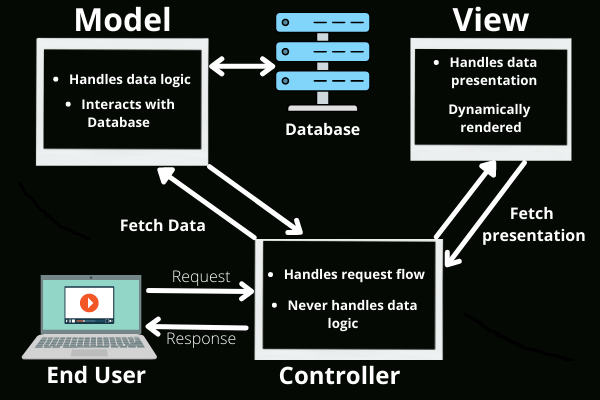
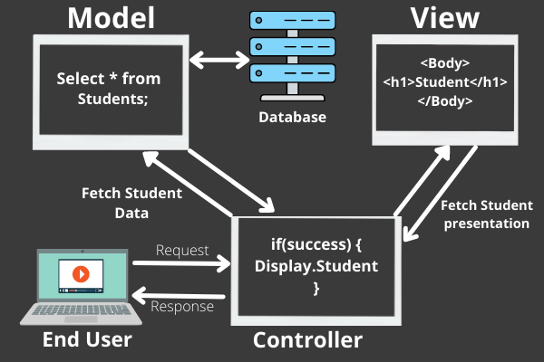
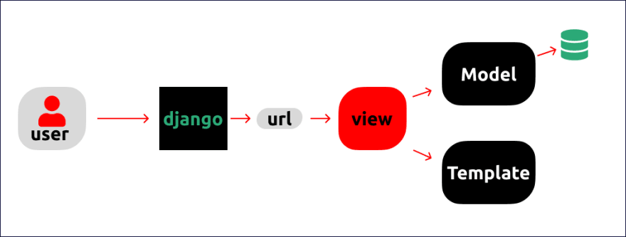
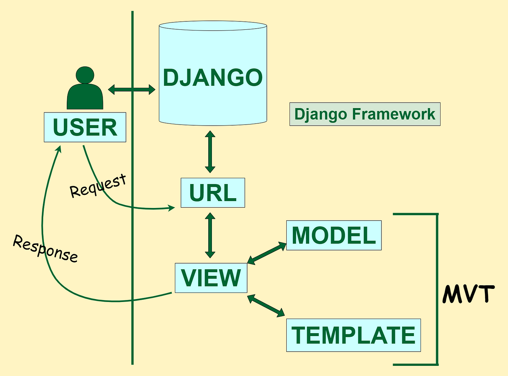

## Project Overview: News Aggregator Website
In this project, we'll create a News Aggregator Website with four key objectives:

- **Collect RSS Feeds:** We'll start by fetching news articles from various XML-based RSS feeds
  - https://www.wired.com/feed/rss
  - https://www.theguardian.com/world/rss
- **Store RSS Feeds:** Next, we'll store these articles in a database.
- **Remove Duplicates:** We'll implement logic to identify and remove duplicate articles.
- **Render on UI:** Finally, we'll display the articles in web interface, sorted by publication time. 

### What is RSS feed?
This is how an item looks like from https://www.wired.com/feed/rss
```xml
<item>
<title>A Backroom Deal Looms Over Section 702 Surveillance Fight</title>
<link>https://www.wired.com/story/section-702-reform-backroom-deal/</link>
<guid isPermaLink="false">65ca42ffce0a0eda3d6718a8</guid>
<pubDate>Mon, 12 Feb 2024 19:15:40 +0000</pubDate>
<media:content/>
<description>Top congressional lawmakers are meeting in private to discuss the future of a widely unpopular surveillance program, worrying members devoted to reforming Section 702.</description>
<category>Security</category>
<category>Security / Privacy</category>
<category>Security / Security News</category>
<category>Politics / Policy</category>
<media:keywords>surveillance, privacy, FBI, NSA, congress</media:keywords>
<dc:creator>Dell Cameron</dc:creator>
<dc:publisher>Condé Nast</dc:publisher>
<dc:subject>Cloakroom & Dagger </dc:subject>
<media:thumbnail url="https://media.wired.com/photos/65ca464cb9f47e3f10ce2b7e/master/pass/Backroom-Deal-Eyed-Suspiciously-in-US-Surveillance-Fight-Security-GettyImages-1988344159.jpg" width="2400" height="1600"/>
</item>
```
- RSS, which stands for **Really Simple Syndication** or **Rich Site Summary**, is a type of web feed that allows users and applications to access updates to online content in a standardized, computer-readable format. 
- These feeds can, for example, allow a user to keep track of many different websites in a single news aggregator.

- The format of the item shown from Wired's RSS feed is indeed a standard format. 
- Here's a breakdown of the common elements in an RSS feed item:

`<title>`: The title of the content (in this case, an article).  
`<link>`: The URL to the full content.  
`<guid>`: A unique identifier for the item. The isPermaLink attribute indicates whether the GUID is a permanent URL or not.  
`<pubDate>`: The publication date and time of the content.  
`<media:content>`: This element is often used to include media like images, videos, etc., within the feed.  
`<description>`: A brief summary or description of the content.  
`<category>`: A tag or category associated with the content. An item can have multiple category elements.  
`<media:keywords>`: Keywords associated with the item, similar to tags.  
`<dc:creator>`: The author of the content.  
`<dc:publisher>`: The publisher of the content.  
`<dc:subject>`: The subject or theme of the content.  
`<media:thumbnail>`: A URL to a thumbnail image representing the content, along with its dimensions.

## Creating the first django project
**Step 1: Install Django**
  - First, you need to install Django. 
  - It's recommended to use a virtual environment for Python projects, including Django projects, to manage dependencies separately for each project. 
  -  Create a virtual environment:
    - `python -m venv myvenv`
  - Activate the virtual environment:
    - On Windows: `myvenv\Scripts\activate`
    - On macOS and Linux: `source myvenv/bin/activate`
  - Install Django within the virtual environment: `pip install django`

**Step 2: Create Your Django Project**
- After installing Django, you can create a new project by running:
```bash
django-admin startproject myproject
```

**Step 3: Run Your Django Project**
- Navigate into your project directory and run the development server:
```bash
cd myproject
python manage.py runserver
```
You should see output indicating the development server is running, and 
it will tell you the address to access it, usually http://127.0.0.1:8000/.

**Step 4: Access Your Project**
- Open a web browser and go to http://127.0.0.1:8000/. 
- You should see the Django welcome screen, which means your project is successfully running.

- Now press `"Ctrl+C"` to terminate the server.

## Distinction between a Django "project" and a Django "app."

### Django Project: 
- This is the entire application and its configuration. 
- When you run `django-admin startproject myproject`, it creates the project structure. 
- This includes:
  - settings for the project (`settings.py`), 
  - URL configurations (`urls.py`), and 
  - other configuration files. 

### Django Project Structure
- In your Django project directory (myproject), you'll find several files created by Django. 
- Here's what they are and their purpose:
- `__init__.py:` 
  - This empty file tells Python that the directory should be considered a Python package. 
  - It's standard in Python packages but doesn't contain any project-specific settings.
- `settings.py:` 
  - This is one of the **most crucial files**. 
  - It contains all the configuration for your Django project. It defines the following: 
    - Database configurations, 
    - installed apps, 
    - middleware, 
    - templates, and more . 
  - When you add new apps to your project, you'll often need to add them to the INSTALLED_APPS setting in this file.
- `urls.py:` 
  - This file is responsible for URL declarations for your project; 
  - it's a **"table of contents"** for your Django-powered site. 
  - It tells Django which views are to be handled by which URLs. 
  - When you create new views in your apps, you'll often link them here or in an app-specific urls.py that you include in this main one.
- wsgi.py: 
  - Stands for Web Server Gateway Interface. 
  - It's a specification for a simple and universal interface between web servers and web applications or frameworks for Python. 
  - This file helps your Django project communicate with the web server, which can be useful when deploying your project.
- asgi.py: 
  - Stands for Asynchronous Server Gateway Interface. 
  - It's a standard for how web servers communicate with asynchronous Python web applications. 
  - It's used for deploying your project in conjunction with ASGI servers, especially useful for applications that require long-lived connections like WebSockets.

### Django App: 
- An app is a web application that does something – e.g., a blog, a database of public records, or a simple poll application. 
- Each app has its own models.py, views.py, urls.py, etc. 
- You create an app within a project to handle a specific piece of functionality. 
- A project can contain multiple apps.
- Lets create a Django "app"
```bash
python manage.py startapp aggregator
```
- This command creates a new directory within your project named aggregator (or whatever you named your app), and this directory will contain the views.py file among others (models.py, tests.py, admin.py, etc.).
- Your project structure should now look something like this:

```markdown
myproject/
    manage.py
    myproject/
        __init__.py
        asgi.py
        settings.py
        urls.py
        wsgi.py
    aggregator/
        migrations/
            __init__.py
        __init__.py
        admin.py
        apps.py
        models.py
        tests.py
        views.py
```
- In views.py within your app (aggregator/views.py), you can start defining views for your application. 
- For example, a simple view could look like this:
```python
# aggregator/views.py
from django.http import HttpResponse

def home(request):
    return HttpResponse("Hello, Django!")
```

- To hook this view up to your project, you'd include it in your URL configurations. 
- You'd first add a path to your app in the project's urls.py file:

```python
# myproject/urls.py
from django.urls import path, include  # Import include

urlpatterns = [
    path('admin/', admin.site.urls),
    path('', include('aggregator.urls')),  # Include your app's urls.py
]
```
- And then create a `urls.py` in your app directory (aggregator/urls.py) if it doesn't already exist, defining a URL pattern for the view:
```python
# aggregator/urls.py
from django.urls import path
from . import views

urlpatterns = [
    path('', views.home, name='home'),
]
```
- This setup tells Django to serve the home view you defined in `views.py` when you navigate to the root URL of your project.
- Open a web browser and go to http://127.0.0.1:8000/


### Django App Structure (Aggregator)
- Within your newly created Django app, "aggregator", you'll find a set of files as well. 
- Each has a specific role:
- **views.py:** 
  - **This is the heart of the application's logic.**
  - Views handle the HTTP requests and return HTTP responses. 
  - This file defines functions or classes corresponding to different URLs specified in `urls.py`.
- `__init__.py`: 
  - This file is a Python convention that marks the directory as a Python package. 
  - It is usually empty but can be used to include package-level variables or initialization code.
- **admin.py:** 
  - This file is used to register your models with the Django admin interface, 
  - making it easier to perform create, read, update, and delete operations on your models directly from a web interface provided by Django.
- **apps.py:** 
  - Contains the configuration for your app. 
  - Here, you can include any app-specific settings.
- **models.py:** 
  - This file defines the structure of your application's data. 
  - Django uses these class definitions to create database tables using an ORM (Object-Relational Mapping) system.
  - These classes will become the database tables in your app.  
- **tests.py:** 
  - For your app's tests. Django has a built-in framework for writing and running tests.
  - You can define test classes here to test the functionality of your models, views, forms, and other parts of your app.
- **migrations/ directory:** 
  - This directory contains migrations files for your app - they are changes you make to your models.py over time (like creating a new model, or adding a field to an existing model). 
  - Django generates Python files in this directory to keep track of your database schema changes.

## What is MVC in Web Frameworks?


- MVC stands for **Model-View-Controller**. 
- It is a software design pattern commonly used for developing user interfaces that divides the related program logic into three interconnected elements. 
- This is done to separate internal representations of information from the ways information is presented to and accepted from the user.
- **Model:** 
  - The central component of the pattern. 
  - It is the application's dynamic data structure, independent of the user interface. 
  - It directly manages the data, logic, and rules of the application.
- **View:** 
  - Any representation of information such as a chart, diagram, or table. 
  - Multiple views of the same information are possible.

- **Controller:** 
  - Accepts input and converts it to commands for the model or view.

## MVC Implementation in Django



- Django follows a slightly modified MVC pattern, often referred to as the **MVT (Model-View-Template)** pattern.
- **Model (M):** 
  - In Django, the `models.py` file represents the Model component. 
  - It is responsible for managing data and business logic.
- **View (V):** 
  - The View component is handled by what Django calls views, defined in `views.py`. 
  - Views process user requests, interact with the model, and return the appropriate response to the user.
- **Template (T):** 
  - Django's Template is the equivalent of the Controller in MVC, but it's also a mix of View's responsibilities. 
  - Templates are HTML files that handle the presentation layer and are populated with data from the views.
- **Controller:** 
  - Django itself acts as the Controller, managing the interactions between the Model and the View/Template. 
  - It takes care of the backend processes, URL routing, and serving responses.

- Each component in the Django framework is interconnected, with `urls.py` directing HTTP requests to the appropriate view, the view interacting with the model as needed, and any response typically rendered using a template, which is then served to the client.

### Let's add a new endpoint `gather_feeds`
```python
# aggregator/urls.py
from django.urls import path
from . import views

urlpatterns = [
    path('', views.home),
    path('gather_feed/', views.gather_feed),
]
```
---
## Step 1: Setting Up a Basic Django View to Display RSS Feed Titles
#### Objective: 
- Start with a simple Django view that fetches an RSS feed and 
- Displays the title of each article.

#### Key Concepts Introduced:
- Basic Django view setup.
- Fetching data from an external RSS feed using the feedparser library.
- Building a simple HTML content string in Django to display data.
- Understanding of RSS feeds and their structure.
#### Instructions:
- **Install feedparser:** Begin by installing the feedparser library, which simplifies parsing RSS feeds.
- **Create a Basic View:** In the `views.py` file of your Django app (e.g., aggregator), define a function gather_feed that fetches an RSS feed and constructs a simple HTML string to display the title of the first article.
- **RSS Feed Parsing:** Use feedparser.parse(feed_url) to parse the RSS feed from a URL like https://www.wired.com/feed/rss.
- **Display Article Title:** Extract and display the titles of articles in the feed using a basic HTML template string.
```python
# aggregator/views.py
import feedparser
from django.http import HttpResponse, JsonResponse
import pprint
def home(request):
    return HttpResponse("Hello, Django!")

def gather_feed(request):
    # Example RSS feed
    feed_url = 'https://www.wired.com/feed/rss'
    feed = feedparser.parse(feed_url)

    # Build a simple HTML string to display the titles
    content = '<h1>Latest Wired Articles</h1>'
    for entry in feed['entries']:
        pprint.pprint(entry)
        content += f"<p>{entry.title}</p>"
    return HttpResponse(content)
```
---
## Step 2: Enhancing the View to Handle Multiple RSS Feeds and Display More Information
#### Objective: 
- Expand the initial view to handle multiple RSS feeds and 
- Display additional details about each article, such as the title, description, publication date, and author.
#### Key Concepts Introduced:
- Handling multiple sources in a Django view.
- Looping through data structures in Python (dictionaries and lists).
- Extracting and displaying multiple pieces of information from each RSS feed entry.
- Basic HTML formatting in Django views.
#### Instructions:
- **Define Multiple Feeds:** 
  - Update the view to include a dictionary mapping RSS feed URLs to human-readable names. 
  - This allows for easy addition of new feeds and improves code readability.
- **Loop Through Feeds:** 
  - Modify the view to iterate over each feed URL, parse the feed, and then iterate over each entry (article) in the feed.
- **Extract Additional Information:** 
  - For each article, extract not just the title but also the description, publication date, and author. 
  - Include checks to handle missing information gracefully.
- **Format HTML Output:** 
  - Update the HTML content string to include this additional information, using basic formatting to organize the output.
```python
# aggregator/views.py
def gather_feed(request):
    feeds = {
        'https://www.wired.com/feed/rss': 'Wired',
        'https://feeds.a.dj.com/rss/RSSWorldNews.xml': 'Wall Street Journal - World News',
    }

    content = '<h1>Latest Articles</h1>'

    for feed_url, feed_name in feeds.items():
        feed = feedparser.parse(feed_url)

        content += f'<h2>Articles from {feed_name}</h2>'

        for entry in feed.entries:

            title = entry.title if 'title' in entry else 'No Title'
            description = entry.summary if 'summary' in entry else 'No Description'
            pub_date = entry.published if 'published' in entry else None
            author = entry.author if 'author' in entry else 'No Author'

            content += f"<div><strong>Title:</strong> {title}<br>"
            content += f"<strong>Description:</strong> {description}<br>"
            content += f"<strong>Publication Date:</strong> {pub_date}<br>"
            content += f"<strong>Author:</strong> {author}</div><br>"

    return HttpResponse(content)
```
---
## Step 3: Storing Articles in the Database
#### Objective: 
- Modify the view to save articles into the Django project's database, in addition to displaying them. 
- This introduces database operations in Django.
#### Key Concepts Introduced:
- Django models and database migrations.
- Saving data to a database from a Django view.
- Further enhancement of HTML output.
#### Instructions:
- **Create an Article Model:** 
  - Define a Django model in models.py to represent the articles, with fields for title, description, publication date, author, and source.
- **Migrate the Database:** 
  - Use Django's migration system to create the necessary table(s) in the database.
- **Update the View to Save Articles:** 
  - Modify the `gather_feed` view to create and save an instance of the Article model for each article fetched from the RSS feeds.
```python
# aggregator/models.py
from django.db import models

class Article(models.Model):
    guid = models.CharField(max_length=255, unique=True)
    title = models.CharField(max_length=255)
    description = models.TextField()
    publication_date = models.DateTimeField()
    author = models.CharField(max_length=100, blank=True, null=True)
    source = models.CharField(max_length=255)
    url = models.URLField(max_length=500, blank=True, null=True)
    image_url = models.URLField(max_length=500, blank=True, null=True)
```

```python
# aggregator/views.py
from dateutil import parser

def gather_feed(request):
    feeds = {
        'https://www.wired.com/feed/rss': 'Wired',
        'https://feeds.a.dj.com/rss/RSSWorldNews.xml': 'Wall Street Journal - World News',
    }

    for feed_url, feed_name in feeds.items():
        feed = feedparser.parse(feed_url)

        for entry in feed.entries:
            guid = entry.id
            title = entry.title if 'title' in entry else 'No Title'
            description = entry.summary if 'summary' in entry else 'No Description'
            publication_date = parser.parse(entry.published) if 'published' in entry else None
            author = entry.author if 'author' in entry else 'No Author'
            url = entry.link if 'link' in entry else None
            
            image_url = 'https://upload.wikimedia.org/wikipedia/commons/c/c3/Python-logo-notext.svg'
            if 'media_thumbnail' in entry:
                image_url = entry.media_thumbnail[0]['url'] if entry.media_thumbnail else image_url

            # Use update_or_create to either update existing or create new article
            article, created = Article.objects.update_or_create(
                guid=guid,
                defaults={
                    'title': title,
                    'description': description,
                    'publication_date': publication_date,
                    'author': author,
                    'source': feed_name,
                    'url': url,
                    'image_url': image_url,
                }
            )

    # Build the HTML content to display articles
    content = '<h1>Articles in Chronological Order</h1>'
    for article in articles:
        content += f"<div><strong>GUID:</strong> {article.guid}<br>"
        content += f"<strong>Publication Date:</strong> {article.publication_date}<br>"
        content += f"<strong>Source:</strong> {article.source}<br>"
        content += f"<strong>Title:</strong> {article.title}<br>"
        content += f"<strong>Author:</strong> {article.author}<br>"
        content += f"<strong>URL:</strong> <a href='{article.url}'>{article.url}</a><br>"
        content += f"<strong>Image:</strong> <br>"
        content += "</div><br>"

    return HttpResponse(content)
```
---
## Step 4: Chronological Display of Articles with Date Parsing and Model Update
#### Objective: 
- Enhance the Django application to display articles stored in the database in chronological order. 
- This step involves modifying the view to sort and display articles based on these dates to enhance the user experience by displaying the latest content first.
- Construct HTML content to display these sorted articles.
```python
def gather_feed(request):
    feeds = {
        'https://www.wired.com/feed/rss': 'Wired',
        'https://feeds.a.dj.com/rss/RSSWorldNews.xml': 'Wall Street Journal - World News',
    }

    for feed_url, feed_name in feeds.items():
        feed = feedparser.parse(feed_url)

        for entry in feed.entries:
            guid = entry.id
            title = entry.title if 'title' in entry else 'No Title'
            description = entry.summary if 'summary' in entry else 'No Description'
            publication_date = parser.parse(entry.published) if 'published' in entry else None
            author = entry.author if 'author' in entry else 'No Author'
            url = entry.link if 'link' in entry else None
            
            image_url = 'https://upload.wikimedia.org/wikipedia/commons/c/c3/Python-logo-notext.svg'
            if 'media_thumbnail' in entry:
                image_url = entry.media_thumbnail[0]['url'] if entry.media_thumbnail else image_url

            # Use update_or_create to either update existing or create new article
            article, created = Article.objects.update_or_create(
                guid=guid,
                defaults={
                    'title': title,
                    'description': description,
                    'publication_date': publication_date,
                    'author': author,
                    'source': feed_name,
                    'url': url,
                    'image_url': image_url,
                }
            )
    # Sort the article chronologically
    articles = Article.objects.all().order_by('-publication_date')

    # Build the HTML content to display articles
    content = '<h1>Articles in Chronological Order</h1>'
    for article in articles:
        content += f"<div><strong>GUID:</strong> {article.guid}<br>"
        content += f"<strong>Publication Date:</strong> {article.publication_date}<br>"
        content += f"<strong>Source:</strong> {article.source}<br>"
        content += f"<strong>Title:</strong> {article.title}<br>"
        content += f"<strong>Author:</strong> {article.author}<br>"
        content += f"<strong>URL:</strong> <a href='{article.url}'>{article.url}</a><br>"
        content += f"<strong>Image:</strong> <br>"
        content += "</div><br>"

    return HttpResponse(content)
```
---
## Step 6: Integrating Django Templating for Dynamic Content Rendering

### Django Templating System
- Django's templating system provides a way to generate HTML dynamically. 
- The templating system allows developers to create templates, which are HTML files that contain variables and tags. 
- These variables and tags get replaced with actual values when the template is rendered, allowing for dynamic content generation. 

- Here's a breakdown of its main components:
  - **Templates:** 
    - HTML files that allow Python-like expressions for dynamic content generation.
    - Templates can inherit from other templates, allowing for reusable layout and components.
  - **Variables:** 
    - Represented by `{{ variable_name }}` syntax. 
    - When a template is rendered, these placeholders are replaced with values from the context passed to the template.
  - **Tags:** 
    - Enclosed within `` syntax, tags provide logic in templates. 
    - They can perform loops, conditionals, and other control structures within the template. 
    - Common tags include ``, ``, and ``.
  - **Context:** 
    - A dictionary of values that are passed to the template to replace variables. 
    - The context contains the data the template needs to render the final HTML.

#### Objective: 
Implement Django's templating system to render articles dynamically, facilitating a more interactive and engaging user interface. 
This step transitions the web application from generating HTML content directly within views to utilizing templates, enhancing both the developer and user experience.
#### Key Concepts Introduced:
- Django Templating Language (DTL)
- Context Passing
#### Instructions:
- Create a directory named `templates` in aggregator app
- Inside templates, create an HTML file (e.g., articles_list.html). 
- This file will serve as the template for displaying articles.
- Write HTML mixed with Django Template Language (DTL) code to dynamically display articles.
- In `articles_list.html`, use DTL to iterate over articles passed to the template and display their properties (title, description, etc.).
- We will use a new endpoint - `show_articles` to render the news articles.

```python
# aggregator/urls.py
from django.urls import path
from . import views

urlpatterns = [
    path('', views.home),
    path('gather_feed/', views.gather_feed),
    path('show_articles/', views.show_articles),
]
```

```python
# aggregator/views.py
from django.shortcuts import render

def show_articles(request):
    # Sort the article chronologically
    articles = Article.objects.all().order_by('-publication_date')
    return render(request, 'articles_list.html', {'articles': articles})

def home(request):
    return HttpResponse("Hello, Django!")

def gather_feed(request):
    # existing code
```

```html
<!-- aggregator/templates/articles_list.html -->
<!DOCTYPE html>
<html lang="en">
<head>
  <meta charset="UTF-8">
  <title>News Aggregator</title>
</head>
<body>
  <h1>Articles in Chronological Order</h1>
  <div>
    
    <div>
      <h2>{{ article.title }}</h2>
      <p><strong>Publication Date:</strong> {{ article.publication_date }}</p>
      <p><strong>Author:</strong> {{ article.author }}</p>
      <p>{{ article.description }}</p>
    </div>
    
  </div>
</body>
</html>
```

```html
<!-- HTML with CSS styling added -->
<!DOCTYPE html>
<html lang="en">
<head>
  <meta charset="UTF-8">
  <title>News Aggregator</title>
  <style>
    body {
      font-family: 'Segoe UI', Tahoma, Geneva, Verdana, sans-serif;
      margin: 0;
      padding: 0;
      background-color: #ccc;
      color: #333;
    }
    .container {
      width: 80%;
      margin: auto;
      overflow: auto;
    }
    .article {
      background: #fff;
      margin: 20px 0;
      padding: 20px;
    }
    .article h2 {
      font-size: 1.5em;
      margin-bottom: 10px;
    }
    .article-metadata {
      font-size: 0.8em;
      color: #888;
      margin-bottom: 10px;
    }
    .article p {
      line-height: 1.6;
    }
    .author {
      font-style: italic;
      color: #333;
    }
    hr {
      margin-top: 20px;
      border: 0;
      height: 1px;
      background: #ccc;
    }
    .image {
      float: right;
      margin-left: 15px;
    }
  </style>
</head>
<body>
  <div class="container">
    <h1>Latest News</h1>
    
      <div class="article">
        
          
        
        <h2>{{ article.title }}</h2>
        <div class="article-metadata">
          <span>{{ article.source }} - {{ article.publication_date|date:"F j, Y, g:i a" }}</span>
        </div>
        <p>{{ article.description }}</p>
        <hr>
        <p class="author">Author: {{ article.author|default:"No Author" }}</p>
      </div>
    
      <p>No articles found.</p>
    
  </div>
</body>
</html>
```

---
## Step 7: Creating a RESTful API Endpoint with Django REST Framework
### Understanding REST


- REST stands for Representational State Transfer. 
- It is an architectural style for designing networked applications. 
- RESTful applications use HTTP requests to perform CRUD (Create, Read, Update, Delete) operations on data modeled as resources. 
- Key principles of REST include:
  - **Statelessness:** 
    - Each HTTP request from a client to a server must contain all the information the server needs to understand and respond to the request. 
    - The server does not store any client context between requests.
  - **Client-Server Architecture:** 
    - The client and the server operate independently, allowing each to evolve separately.
  - **Uniform Interface:** 
    - REST uses standard HTTP methods (GET, POST, PUT, DELETE) in a consistent way to interact with resources, identified by URLs.
  - **Layered System:** 
    - Client-server interactions can be mediated by intermediary layers (like proxies or gateways) to enhance scalability, security, or performance.
### Introduction to Django REST Framework (DRF)
- Django REST Framework is a powerful toolkit for building Web APIs in Django applications.
- It simplifies the process of creating RESTful APIs by providing a set of highly customizable tools. 
- Key features include:
  - **Serialization:** Converts complex data types (like Django models) into Python data types that can then be easily rendered into JSON, XML, or other content types.
  - **Browsable API:** Generates web-browsable endpoints for easy testing and debugging of APIs by developers.

#### Objective:
- Implement a RESTful API endpoint using Django REST Framework (DRF) to retrieve and display articles stored in the Django project's database in JSON format. 
- This step introduces REST principles, the use of Django REST Framework, and serialization of Django models.
#### Key Concepts Introduced:
- REST and RESTful API design principles.
- Introduction to Django REST Framework (DRF).
- Serialization of Django models to JSON.
- Handling HTTP GET requests in Django views.
#### Instructions:
1. Create an Article Serializer:
2. Fetch articles from the database and serialize them into JSON format using the ArticleSerializer.

- **@api_view(['GET']):** 
  - This decorator indicates that the api function is a view that responds to HTTP GET requests. 
  - It's part of DRF's way of creating simple, function-based views.
- **Serializing Articles:** 
- `serializer = ArticleSerializer(articles, many=True)` creates a `ArticleSerializer` instance, passing the queryset of articles to it. 
- The `many=True` argument indicates that we're serializing a queryset (multiple instances) rather than a single model instance.
- **Returning JSON Response:** 
  - `return Response(serializer.data)` returns a Response object containing the serialized data. 
  - DRF handles converting this data into JSON format and setting the appropriate HTTP headers.

```python
# aggregator/views.py
# ... existing code ..
from rest_framework import serializers
from rest_framework.decorators import api_view
from rest_framework.response import Response


# Create an Article Serializer
class ArticleSerializer(serializers.ModelSerializer):
    class Meta:
        model = Article
        fields = '__all__'


@api_view(['GET'])
def api(request):
    # Fetch articles from the database
    articles = Article.objects.all().order_by('-publication_date')
    # Serialize them into JSON format using the ArticleSerializer.
    serializer = ArticleSerializer(articles, many=True)
    return Response(serializer.data)
```

