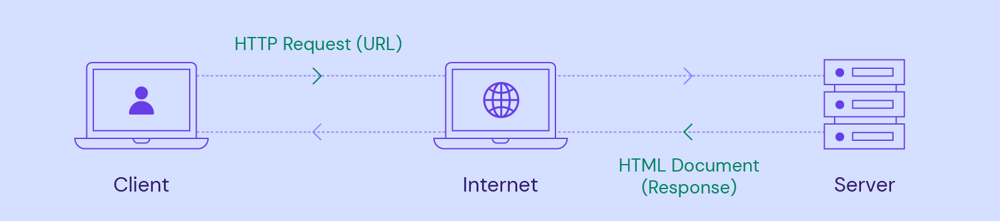
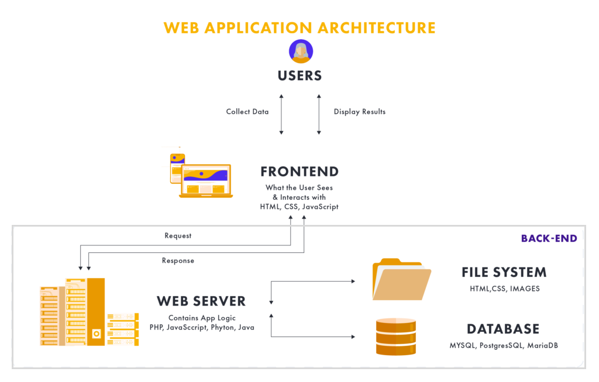
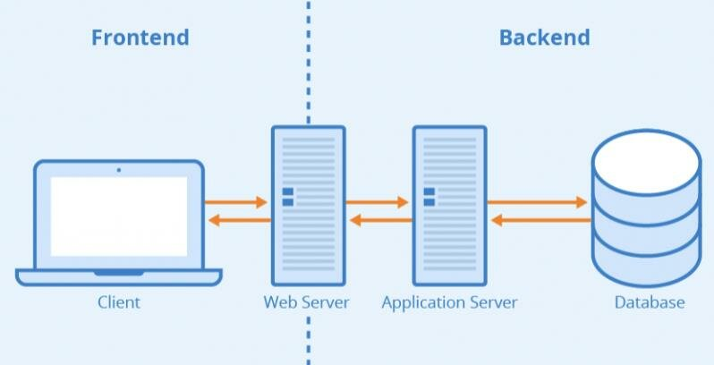
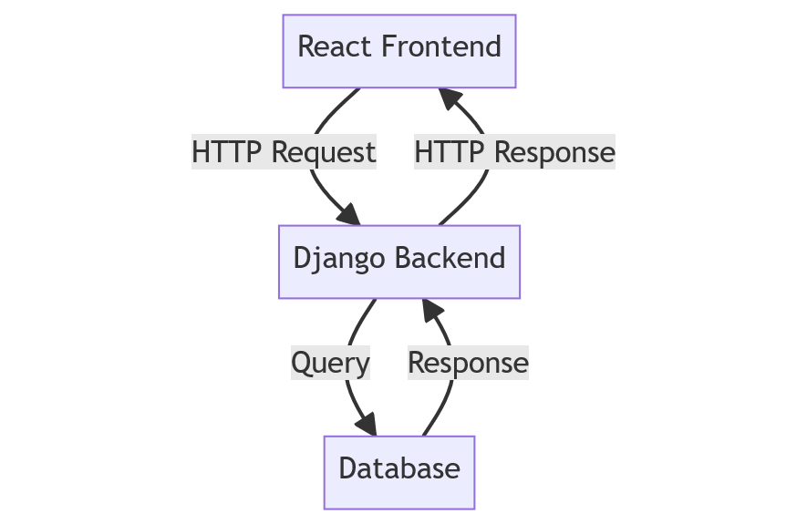
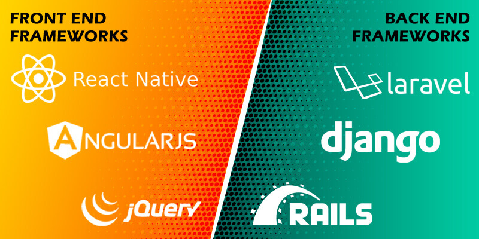
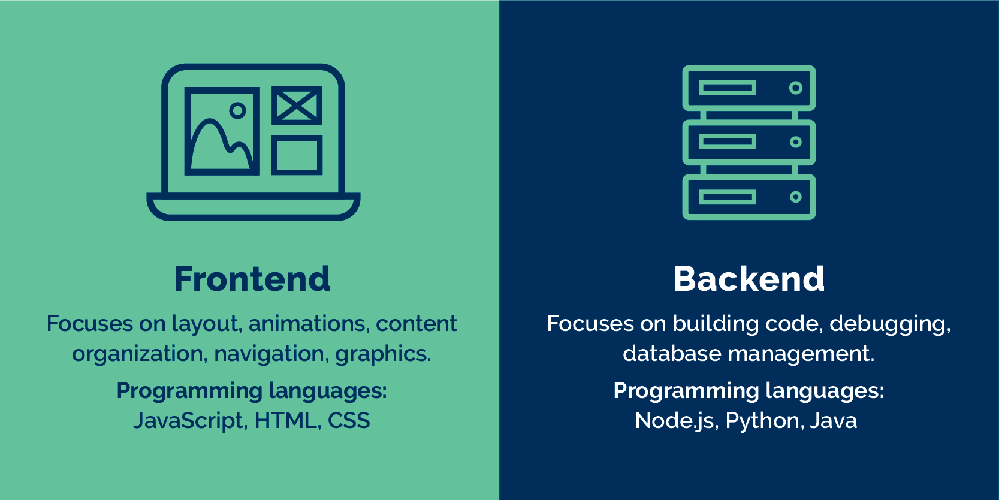
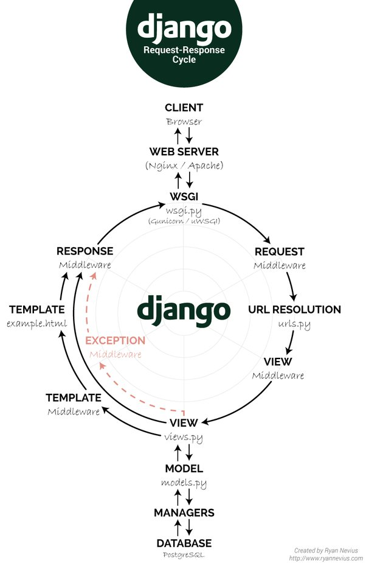
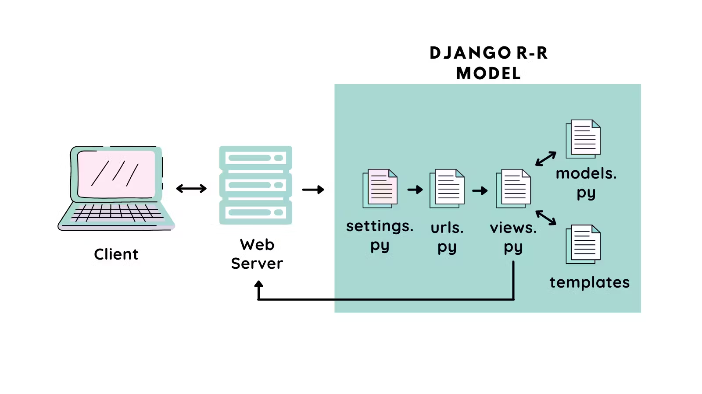
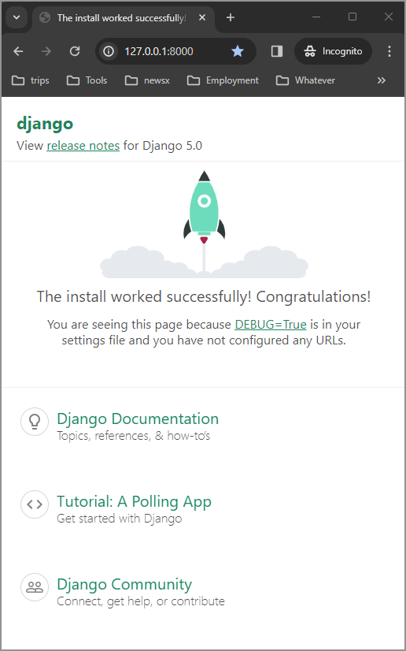
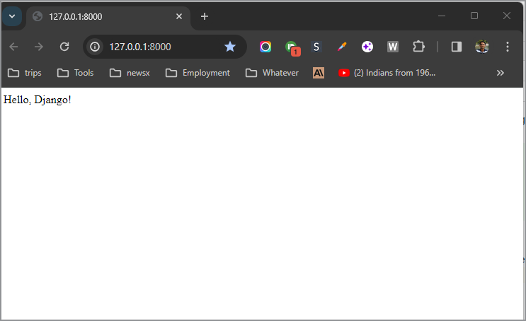

## Introduction to Web Development
- Web development is the process of building and maintaining websites.
- it's the work that happens behind the scenes to make a website look great, work fast, and offer a consistent user experience across different web browsers and devices.

## Basics of the Web












The web operates through a **client-server architecture**, a foundational concept that underpins much of the internet's functionality.
- **Servers**:
  - These are powerful computers that store and manage website resources, such as HTML files, CSS stylesheets, JavaScript files, and multimedia content. 
  - They are responsible for serving these resources upon request.
- **Clients** 
  - These are devices that users interact with to access web resources, such as computers, mobile phones, or tablets. 
  - The client runs a web browser (like Chrome, Firefox, Safari) which sends requests to servers to fetch web resources.
- **HTTP/HTTPS Protocols:** 
  - HTTP (Hypertext Transfer Protocol) and HTTPS (HTTP Secure) are protocols for transmitting hypermedia documents, such as HTML. 
  - They define how messages are formatted and transmitted, and how web servers and browsers should respond to various commands. 
    - **HTTP** provides a set of rules for how information is exchanged on the web, allowing for the retrieval of web resources via URLs.
    - **HTTPS** is the secure version of HTTP, which adds a layer of encryption (SSL/TLS) to the data exchange, protecting the integrity and confidentiality of data between the client's browser and the server.

### The Request-Response Cycle
- **Request:** 
  - The cycle begins when a user enters a URL into their browser or clicks a link. 
  - The browser sends an HTTP request to the server asking for the web page identified by the URL.
- **Processing:** 
  - The server receives the request, processes it, and finds the requested resources. 
  - If necessary, server-side scripts (e.g., PHP, Python) are executed to generate dynamic content.
- **Response:** 
  - The server responds to the browser with an HTTP response message, which includes the requested web page resources, such as HTML, CSS, and JavaScript files, along with a status code (e.g., 200 OK, 404 Not Found).
- **Rendering:** 
  - The browser receives the response, interprets the HTML, CSS, and JavaScript, and renders the web page for the user to view.

## What are Web Frameworks?
- Web frameworks are software libraries designed to support the development of web applications, web services, and web resources. 
- They provide a standardized way to build and deploy web applications on the internet. 
- Web frameworks aim to automate the overhead associated with common activities performed in web development, such as routing web requests, handling sessions, managing security, interacting with databases, and rendering HTML pages.

- Frameworks follow specific design patterns, such as **Model-View-Controller (MVC)**, to organize code in a way that separates the application's data model, user interface, and control logic, making it easier to manage and scale the development process. 
- They come in various shapes and sizes, tailored for different programming languages like Python, JavaScript, Ruby, PHP, and more, each offering libraries and tools that fit the language's ecosystem.

Advantages of Using Frameworks
1. Speeds Up Development
2. Enforces Good Practices
3. Manages Complexity
4. Community and Documentation
5. Enhanced Security

## Overview of Web Framework Categories
- Web development frameworks can be broadly categorized into two main types: 
  - front-end frameworks and 
  - back-end frameworks. 

### Front-end Frameworks
- Front-end frameworks focus on the user interface and user experience of web applications. 
- They provide developers with tools and libraries to build dynamic, interactive, and responsive web interfaces. 
- These frameworks typically use JavaScript and offer components or directives to efficiently handle DOM (Document Object Model) manipulation, data binding, and state management, among other client-side functionalities.
- Examples:
  - **React:** - Developed by **Facebook**, includes a **virtual DOM** for efficient rendering and a unidirectional data flow model.
  - **Angular:** - Maintained by **Google**, Angular is a comprehensive framework that offers a wide range of features out of the box, including two-way data binding, dependency injection, routing, and form validation.
  - **Vue.js:** - It is a progressive JavaScript framework used for building user interfaces. 
    
### Back-end Frameworks
- Back-end frameworks deal with **server-side logic, databases, and application integration**. 
- They provide the tools and libraries necessary for database manipulation, routing, session management, and security, facilitating the development of the server-side logic that powers web applications.
- Examples:  
  - **Django (Python):** 
    - A high-level Python web framework that encourages rapid development and clean, pragmatic design.
    - Django follows the DRY (Don't Repeat Yourself) principle and includes an ORM (Object-Relational Mapping) for database manipulation, a built-in administration interface, and features for security such as protection against SQL injection, CSRF, and XSS.
  - **Flask (Python):** 
    - Also for Python, Flask is a micro-framework that is lightweight and flexible, making it suitable for a wide range of applications from simple web apps to complex RESTful APIs. 
    - Flask provides the basics but allows for extensions to add features such as ORM, form validation, and authentication mechanisms.
  - **Ruby on Rails (Ruby):** 
    - A convention-over-configuration framework for Ruby, Rails is known for its ease of use and speed of development. 
    - It includes everything needed to create database-backed web applications according to the MVC pattern, offering conventions for best practices in web development.
  - **Express (Node.js):** 
    - A minimal and flexible Node.js web application framework, Express provides a robust set of features for web and mobile applications. 
    - It is designed for building APIs and web applications and is known for its performance and minimalistic structure.
  - **Spring Boot(Java)**
  - **laravel (PHP)**
  
## Preparing for Django
- Django, a high-level Python web framework, has gained significant popularity for web development due to its **"batteries-included"** approach, meaning it provides a wide array of built-in features for common web development needs.This comprehensive suite of functionalities includes 
    1. authentication
    2. URL routing
    3. template engine 
    4. ORM (Object-Relational Mapping), and more
- **Scalability:** 
  - Designed to help developers build scalable applications, Django facilitates handling high volumes of traffic and data with ease. 
  - Its architecture is built to scale up to meet increased demand, making it suitable for projects ranging from small websites to large-scale enterprise systems.
- **Security:** 
  - Django places a strong emphasis on security and helps developers avoid many common security mistakes, such as SQL injection, cross-site scripting, cross-site request forgery, and clickjacking. 
  - Its user authentication system provides a secure way to manage user accounts and passwords.




## Project Overview: News Aggregator Website
In this project, we'll create a News Aggregator Website with four key objectives:

- **Collect XML Feeds:** We'll start by fetching news articles from various XML-based RSS feeds
  - https://www.wired.com/feed/rss
  - https://www.theguardian.com/world/rss
- **Store XML Feeds:** Next, we'll store these articles in a database.
- **Remove Duplicates:** We'll implement logic to identify and remove duplicate articles.
- **Render on UI:** Finally, we'll display the articles in web interface, sorted by publication time. 

## Creating the first django project
**Step 1: Install Django**
  - First, you need to install Django. 
  - It's recommended to use a virtual environment for Python projects, including Django projects, to manage dependencies separately for each project. 
  -  Create a virtual environment:
    - `python -m venv myvenv`
  - Activate the virtual environment:
    - On Windows: `myvenv\Scripts\activate`
    - On macOS and Linux: `source myvenv/bin/activate`
  - Install Django within the virtual environment: `pip install django`

**Step 2: Create Your Django Project**
- After installing Django, you can create a new project by running:
```bash
django-admin startproject myproject
```

**Step 3: Run Your Django Project**
- Navigate into your project directory and run the development server:
```bash
cd myproject
python manage.py runserver
```
You should see output indicating the development server is running, and 
it will tell you the address to access it, usually http://127.0.0.1:8000/.

**Step 4: Access Your Project**
- Open a web browser and go to http://127.0.0.1:8000/. 
- You should see the Django welcome screen, which means your project is successfully running.

- Now press `"Ctrl+C"` to terminate the server.

## Distinction between a Django "project" and a Django "app."

### Django Project: 
- This is the entire application and its configuration. 
- When you run `django-admin startproject myproject`, it creates the project structure. 
- This includes:
  - settings for the project (`settings.py`), 
  - URL configurations (`urls.py`), and 
  - other configuration files. 

### Django Project Structure
- In your Django project directory (myproject), you'll find several files created by Django. 
- Here's what they are and their purpose:
- `__init__.py:` 
  - This empty file tells Python that the directory should be considered a Python package. 
  - It's standard in Python packages but doesn't contain any project-specific settings.
- `settings.py:` 
  - This is one of the **most crucial files**. 
  - It contains all the configuration for your Django project. It defines the following: 
    - Database configurations, 
    - installed apps, 
    - middleware, 
    - templates, and more . 
  - When you add new apps to your project, you'll often need to add them to the INSTALLED_APPS setting in this file.
- `urls.py:` 
  - This file is responsible for URL declarations for your project; 
  - it's a **"table of contents"** for your Django-powered site. 
  - It tells Django which views are to be handled by which URLs. 
  - When you create new views in your apps, you'll often link them here or in an app-specific urls.py that you include in this main one.
- wsgi.py: 
  - Stands for Web Server Gateway Interface. 
  - It's a specification for a simple and universal interface between web servers and web applications or frameworks for Python. 
  - This file helps your Django project communicate with the web server, which can be useful when deploying your project.
- asgi.py: 
  - Stands for Asynchronous Server Gateway Interface. 
  - It's a standard for how web servers communicate with asynchronous Python web applications. 
  - It's used for deploying your project in conjunction with ASGI servers, especially useful for applications that require long-lived connections like WebSockets.

### Django App: 
- An app is a web application that does something – e.g., a blog, a database of public records, or a simple poll application. 
- Each app has its own models.py, views.py, urls.py, etc. 
- You create an app within a project to handle a specific piece of functionality. 
- A project can contain multiple apps.
- Lets create a Django "app"
```bash
python manage.py startapp aggregator
```
- This command creates a new directory within your project named aggregator (or whatever you named your app), and this directory will contain the views.py file among others (models.py, tests.py, admin.py, etc.).
- Your project structure should now look something like this:

```markdown
myproject/
    manage.py
    myproject/
        __init__.py
        asgi.py
        settings.py
        urls.py
        wsgi.py
    aggregator/
        migrations/
            __init__.py
        __init__.py
        admin.py
        apps.py
        models.py
        tests.py
        views.py
```
- In views.py within your app (aggregator/views.py), you can start defining views for your application. 
- For example, a simple view could look like this:
```python
# aggregator/views.py
from django.http import HttpResponse

def home(request):
    return HttpResponse("Hello, Django!")
```

- To hook this view up to your project, you'd include it in your URL configurations. 
- You'd first add a path to your app in the project's urls.py file:

```python
# myproject/urls.py
from django.urls import path, include  # Import include

urlpatterns = [
    path('admin/', admin.site.urls),
    path('', include('aggregator.urls')),  # Include your app's urls.py
]
```
- And then create a `urls.py` in your app directory (aggregator/urls.py) if it doesn't already exist, defining a URL pattern for the view:
```python
# aggregator/urls.py
from django.urls import path
from . import views

urlpatterns = [
    path('', views.home, name='home'),
]
```
- This setup tells Django to serve the home view you defined in `views.py` when you navigate to the root URL of your project.
- Open a web browser and go to http://127.0.0.1:8000/


### Django App Structure (Aggregator)
- Within your newly created Django app, "aggregator", you'll find a set of files as well. 
- Each has a specific role:
- **views.py:** 
  - Contains the logic of your application. 
  - Each view receives an HTTP request, processes it, and returns an HTTP response. 
  - This file is where you define the functions or classes that handle what content is displayed on each URL defined in your urls.py.
- `__init__.py`: 
  - Similar to the project's __init__.py, it marks the directory as a Python package.
- **admin.py:** 
  - This file is used to register your models with the Django admin interface, making it easier to perform create, read, update, and delete operations on your models directly from a web interface provided by Django.
- **apps.py:** 
  - Contains the configuration for your app. 
  - Here, you can include any app-specific settings.
- **models.py:** 
  - Defines the data structure. 
  - These classes will become the database tables in your app. 
  - Django uses an ORM (Object-Relational Mapping) to map these models to database tables.
- **tests.py:** 
  - For your app's tests. Django has a built-in framework for writing and running tests.
  - You can define test classes here to test the functionality of your models, views, forms, and other parts of your app.
- **migrations/ directory:** 
  - This directory contains migrations files for your app - they are changes you make to your models.py over time (like creating a new model, or adding a field to an existing model). 
  - Django generates Python files in this directory to keep track of your database schema changes.


