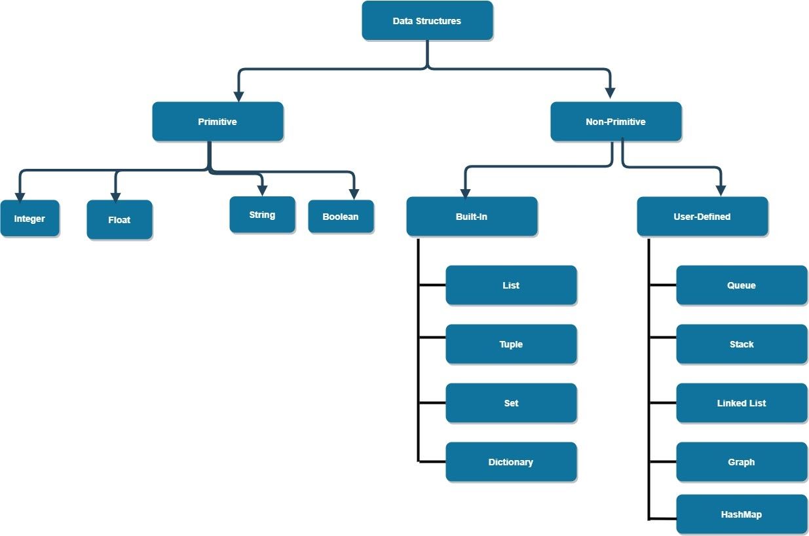

## Day 2: Understanding Python execution, Basic Syntax and Data Types
- Today, we delve into 
  - Python's basic execution process 
  - Understand how to write comments
  - Explore fundamental data types such as integers, floats, strings and booleans.

## Understanding Python's Execution Process: From Source Code to Output
```
[1] Writing a Python Script
      |
      |  hello.py
      |  ----------------
      |  print("Hello World")
      |
      v
[2] Compilation to Bytecode 
      |
      |  Python Compiler
      |  ----------------
      |  Converts hello.py to bytecode (OS independent)
      |  (hello.pyc or similar)
      |
      v
[3] Execution by Python Virtual Machine (PVM)
      |
      |  PVM (Specific to each OS)
      |  -------------------------
      |  Interprets the bytecode
      |  Executes the program
      |
      v
[4] Output on User's Device
      |
      |  Console Output
      |  --------------
      |  "Hello, World"
```

### Is Python an Interpreted or Compiled Language?
- Python is often referred to as an interpreted language, but in reality, it's both interpreted and compiled. 
- Here's how it works:
  1. **Compilation:** 
      - When you write a Python program, the source code you write is first compiled into something called bytecode. 
      - This is a lower-level, platform-independent representation of your source code.
  2. **Interpretation:** 
     - This bytecode is then interpreted by the Python Virtual Machine (PVM) to execute the program.

### What is Bytecode?
- Bytecode is a form of instruction set designed for efficient execution by a software interpreter. 
- In the context of Python, after you write a Python program, the source code (.py files) is first compiled into bytecode(.pyc files).
- This bytecode (.pyc files) is not human-readable like the original source code, but it's a set of instructions that the Python interpreter can execute.

### What is the Python Virtual Machine (PVM)?
- The Python Virtual Machine is an interpreter which reads and executes the bytecode. 
- The PVM is the last step in the process of running a Python script.
- It's the PVM that actually runs your Python programs.

### How is Python Platform Independent?
- The beauty of Python's approach lies in its platform independence. 
- When you write Python code, you don't compile it into machine-specific code. 
- Instead, you compile it into Python bytecode, which is the same for every platform.
- Then, each platform (Windows, macOS, Linux, etc.) has its own version of the PVM that understands how to execute this bytecode. 
- So, you write your Python code once, and it can run on any platform that has a Python interpreter.


## Python Basic Syntax
- Python syntax refers to the set of rules that define how a Python program will be written and interpreted (both by the interpreter and by humans).
- Unlike many other programming languages, Python emphasizes readability and simplicity.

---
## Writing Comments in Python
- Comments are essential for making your code more readable.
- Comments start with a **#**, and everything after **#** on that line is ignored by the interpreter.
  1. **Single-line comments** are great for brief **explanations**.
  2. **Multi-line comments** are often used for **documentation** at the beginning of a function or a file.
    ```python 
    """
    This is a multi-line comment.
    Useful for longer descriptions.
    """
    # This is a single-line comment
    ```  
  
- Check the usage of comments in `C:\Users\RANJANZYX\AppData\Local\Programs\Python\Python312\Lib\logging\handlers.py`
- #### Do:
    - Write comments that explain the 'why', 'for what', or 'how' behind complex code segments.
    - Write readable and clear/concise comments as if they are for someone unfamiliar with the code.
- #### Don't:
    - Over-comment simple code; the code should be self-explanatory as much as possible.
    - Write misleading comments.
      ```python
      """
      Title: Sample Python Script
      Author: Ranjan
      Date: January 9, 2024
      Description: This script is  intended as a tutorial for beginners learning Python programming.    
      """

      # DO: Explain complex logic (Why and How)
      def calculate_discount(price, discount):
        """
        Calculate the discounted price of an item.
    
        :param price: float, the original price of the item
        :param discount: float, the discount percentage (0-100)
        :return: float, the price after applying the discount
        """
        # Checking if discount is applicable
        if discount > 0:
            # Applying discount: price * (100 - discount) / 100
            return price * (100 - discount) / 100
        else:
            # Return the original price if no discount is given
            return price
    
      # DON'T: State the obvious
    
      def add(a, b):
        # Adding two numbers
        return a + b  # This comment is unnecessary as the code is self-explanatory
    
      # DON'T: Leave commented-out code in the final version
      def subtract(a, b):
        # Subtracting b from a
        # result = a - b
        # return result
        return a - b  # Clean and concise without the commented-out code
    
      # DON'T: Write misleading comments
      def multiply(a, b):
        # Divide a by b - This comment is incorrect and misleading
        return a * b  # The function actually multiplies a and b
      ```
---
### Indentation
- Python uses **indentation** to define blocks of code, unlike curly braces in languages like C++ or Java. 
- Each block of code under a statement must be indented by the same amount.
- The standard Python convention is to use **four spaces** for each level of indentation.
- Example of Python Syntax:
```python
# Correct Indentation
if 5 > 2:
    print("Five is greater than two!")  # This line is correctly indented

# Incorrect Indentation
if 5 > 2:
print("This will cause an error.")  # This line is not indented
```
---
### Case Sensitivity
- Python is a case-sensitive programming language, which means that it distinguishes between identifiers based on their case.
- This case sensitivity applies to variables, function names, class names, and other identifiers.
- In Python, `number`, `Number`, and `NUMBER` are treated as three distinct variables due to case sensitivity.
- Being case-sensitive, Python requires consistent use of casing in identifiers, which can sometimes lead to errors if not managed carefully.
```python
number = 10
Number = 20
NUMBER = 30
print(number)  # Outputs 10
print(Number)  # Outputs 20
print(NUMBER)  # Outputs 30
```
- In contrast to Python, there are languages where case sensitivity is not maintained, such as **SQL** and **Fortran**.

---
## Python Data Types


### What is a datatype ?
- A data type in programming refers to the classification of data which tells the compiler or interpreter how the programmer intends to use the data. 
- Data types define what type of value a variable can hold, such as integer numbers, floating-point numbers, strings, etc. 
- They also determine the operations that can be performed on the data and the way it is stored in memory. 
- The concept of data types is fundamental in programming and is crucial for understanding how to manipulate data effectively in any programming language.

 
Data types are often categorized into two main groups: primitive (or basic) data types and composite (or complex) data types.
1. **Primitive Data Types:** 
   - These are the basic data types that form the building blocks of data manipulation in Python. 
   - They typically represent single values and include types like:
     1. Integer (`int`)
     2. Float (`float`)
     3. String (`str`)
     4. Boolean (`bool`)
     5. NoneType (`None`)
2. **Composite Data Types:** 
   - Also known as complex data types, these are used to store collections or more complex data structures. 
   - They can hold multiple items, possibly of different data types, and include types like:
     1. `List`
     2. `Tuple`
     3. `Set`
     4. Dictionary (`dict`)

---
### Integer (int)
- **Definition:** In Python, an integer is a **whole number**, positive or negative, without a fraction.
- **Range:** 
  - Python integers have **unlimited precision**, meaning they can grow to have as many digits as your memory allows. 
  - There's no fixed upper or lower bound.
- **Common Integer Operations:**
  - Arithmetic Operations: Addition (+), Subtraction (-), Multiplication (*), Division (/), Integer Division (//), Modulus (%)
  - Equal to (==), Not equal to (!=)
  - Greater than (>), Less than (<), Greater than or equal to (>=), Less than or equal to (<=)
```python
x = 6
y = 3

print(x + y)  # Output: 9
print(x - y)  # Output: 3
print(x * y)  # Output: 18
print(x / y)  # Output: 2.0
print(x // y)  # Output: 2
print(x % y)  # Output: 0
```

### Floating Point (float)
- **Definition:** In Python, a float represents real numbers, meaning they can have a **fractional part**. 
- Floats are essential for representing numbers that cannot be expressed as integers, such as measurements, scientific calculations, and more.
- **Precision:** Python floats are typically **64-bit double-precision numbers**, giving them a significant degree of accuracy. 
- For example, 1.2e-5 represents 1.2 times 10 to the power of -5 (0.000012).
- Arithmetic Operations: Addition (+), Subtraction (-), Multiplication (*), Division (/), Exponentiation (**)
- Comparison Operations: floats can be compared using ==, !=, >, <, >=, <=.
- **Precision Issues:** Due to their binary representation, floats can sometimes give unexpected results.
```python
a = 0.1
b = 0.2
c = a + b
print(c)  # Might not output 0.3 exactly due to precision; typical output: 0.30000000000000004
print(round(c, 1))  # Output: 0.3
```
### Boolean (bool)
- **Definition:** In Python, a Boolean (or bool) is a data type that represents one of two values: True or False. 
- Booleans are primarily used in conditional statements, making them a fundamental part of controlling the flow of a Python program.
```python
is_student = True
has_id = False

# Using 'and' logical operator
if is_student and has_id:
  print("Access granted")
else:
  print("Access denied")  # This will be executed

# Using 'not' operator
if not has_id:
  print("ID is required")  # This will be printed
```

### None datatype
- In Python, `None` is a special data type that represents the **absence of a value** or a null value. 
- It is an object of its own datatype, the `NoneType`. 
- None is often used to signify 'nothing' or 'no value here'
```python
# Initializing a variable with None
result = None

# Using None in conditional statements
if result is None:
    print("No result yet.")
    # proceed to calculate values
```
### String (str)
- **Definition:** 
  - A string represents a **sequence** of characters.
  - As a sequence, each character in a string has an index, starting from 0.
  - In Python, strings are enclosed in single ('...') or double ("...") quotes with equivalent functionality.
  - **Quotes:** Single quotes are straightforward for most strings, but double quotes are useful to include apostrophes within the string.
  - **Escape Characters:** To include special characters like apostrophes in single-quoted strings, escape characters (like \) are used.
  - **Multi-line Strings:** Triple quotes ('''...''' or """...""") enable the creation of strings that span multiple lines.
  - **Basic Operations:**
    - Concatenation: Joining strings together (+).
    - Formatting: Embedding values into strings (f-strings or format method).
    - Common Methods: strip(), split(), replace(), upper(), lower(), etc.
  
```python
# Single and Double Quotes
greeting = 'Hello, World!'
word = "Bob's world"  # Useful for apostrophes
word_with_escape = 'Bob\'s world'  # Using escape character

# Multi-line String
multi_line_string = """This is a multi-line string
spanning over several lines."""

print(greeting)
print(greeting[0])
print(greeting.upper())
```
---
## Python Type Conversion and Data Types

### Dynamic Typing in Python
- Python is a dynamically typed language, meaning that the type of a variable is determined at runtime. 
- This flexibility allows for more generalized and concise code, but it also requires careful management of variable types, especially when performing various operations. 
```python
salary = 100
print(type(salary))

hike = 1.5
salary = salary * hike
print(type(salary))

salary = "The final salary is " + str(salary)
print(type(salary))
print(salary)
```

- In statically typed languages like **Java**, 
  - Variables have fixed data types
  - Attempting to change the type or mix types without explicit casting results in a compilation error.
```java
// java
int salary = 100;  // Salary declared as an integer
double hike = 1.5;

// Attempting to directly multiply an int and a double results in an error
salary = salary * hike;  

// Concatenating a string with a non-string requires explicit conversion
String salaryString = "The final salary is " + salary;
```


### Understanding Data Types with the type() Function
- To identify the data type of a variable in Python, the type() function is used. 
- This is especially useful in a dynamically typed language, as it helps confirm assumptions about the type of data you are working with.

- Example Usage:
```python
num = 5
print(type(num))  # Output: <class 'int'>

decimal = 5.0
print(type(decimal))  # Output: <class 'float'>

text = "Python Programming"
print(type(text))  # Output: <class 'str'>
```

### Explicit vs Implicit Type Conversion
- Type conversion in Python can be either explicit or implicit. 
- Explicit conversion, also known as type casting, is when you manually convert one data type to another using conversion functions. 
- Implicit conversion happens automatically when Python interprets one data type as another during operations.

#### Explicit Type Conversion
- Explicit type conversion involves using functions like int(), float(), and str() to convert a variable to a different type.
```python
int_to_float = float(5)    # Converts integer 5 to float (5.0)
float_to_int = int(8.7)    # Converts float 8.7 to integer (8)
int_to_str = str(20)       # Converts integer 20 to string ("20")

invalid_conversion = int("hello") # This will cause an error 
```

#### Implicit Type Conversion
- Python automatically performs implicit type conversion to avoid data loss. 
- This occurs during operations involving multiple data types.
```python
num_int = 123
num_float = 1.23

# Implicit conversion of int to float for addition
num_sum = num_int + num_float
print("Sum:", num_sum)  # Output: Sum: 124.23
```

#### Type Conversion in Debugging
- Understanding and diagnosing data type issues is a critical part of debugging in Python. 
- By using type(), you can identify mismatches in data types and perform appropriate conversions.
- Debugging Example:
```python
x = "123"
y = 456

# Understanding the data types
print("Type of x:", type(x))  # Output: <class 'str'>
print("Type of y:", type(y))  # Output: <class 'int'>

# Converting x to an integer for addition
total = int(x) + y
print("Total:", total)  # Output: Total: 579
```

#### When Type Casting is Essential
- In Python, certain operations require explicit type casting to avoid runtime errors and ensure that the operation behaves as intended. 
- One common scenario is when you need to perform operations that involve both numbers and strings. 
- Since these are fundamentally different data types, Python does not implicitly convert one to the other.
- **Adding a Number to a String**
  - Consider a situation where you need to concatenate a string with a number. 
  - Since concatenation is a string operation, any non-string data type must be explicitly converted to a string.
```python
age = 30
greeting = "Hello, I am "

# Attempting to concatenate a string and an integer directly will result in a TypeError
# full_greeting = greeting + age  # This would cause an error

# Correct approach using explicit type conversion
full_greeting = greeting + str(age)
print(full_greeting)  # Output: Hello, I am 30
```

### Difference between `type()` and `isinstance()` Function:
- The **isinstance()** function checks if an object is an instance of a particular class or a tuple of classes. 
- It's used to check if an object inherits from a certain class or a tuple of classes (directly or indirectly).
```python
x = 10
print(isinstance(x, int))  # Output: True
print(isinstance(x, (float, int)))  # Output: True, as x is an instance of int
```
- Advantage: isinstance() is more flexible than type() because it supports class inheritance, making it suitable for checking an object's compatibility with an interface or abstract class.
- In summary, while type() is used for finding the exact type of an object, isinstance() is used to check if an object is of a specific type or a subclass of that type, making it more suitable in polymorphic scenarios.

## Interview Questions
1. What is Dynamic Typing in Python?
2. Can you explain the difference between static and dynamic typing, using Python as an example for dynamic typing?
3. How Does Python Handle Different Data Types During Arithmetic Operations?
4. Give an example of implicit type conversion in Python during an arithmetic operation.
5. What will happen if you try to concatenate string with integer directly without type conversion?
6. What Happens When You Perform Integer Division with Zero in Python?
7. Explain the Use of the type() and isinstance() Functions.

## Coding Assignments
1. Simple Calculator:
    - Write a Python program that performs basic arithmetic operations (addition, subtraction, multiplication, division) on two user-input numbers. 
    - Handle different data types gracefully and provide appropriate output messages.
2. Temperature Converter:
    - Create a Python script that converts temperatures from Celsius to Fahrenheit and vice versa. 
    - Use float data types and ensure proper formatting of the output.

## Conclusion
- Today, we've learned about basic syntax, comments, and fundamental data types in Python.
- Practice these concepts to become familiar with Python's way of coding.
- In our next session, we'll cover variables, basic operators, and input/output in Python.
