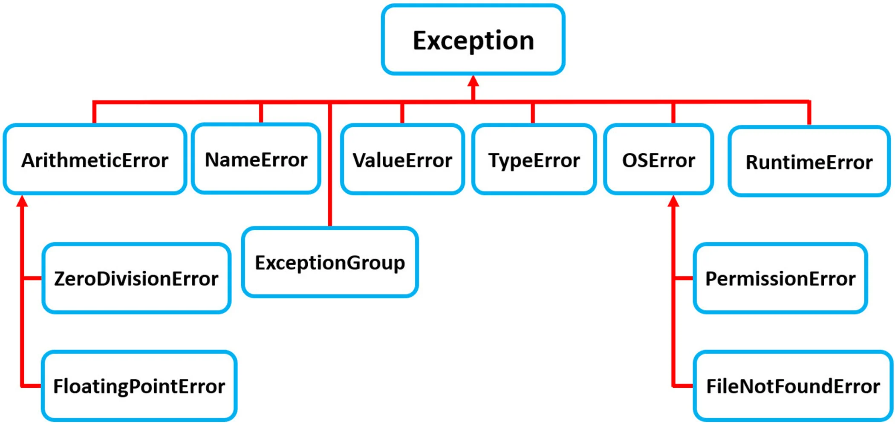

## Introduction
- Welcome to Day 4 of our Python course! 
- Today we focus on control flow mechanisms in Python: conditional statements (**if**, **elif**, **else**) and loops (**for** and **while**). 
- We will also discuss exception handling in Python

## Conditional Statements

### `if` Statement
- The if statement is the most basic form of conditional testing in Python.
- It evaluates a condition and executes the following indented block of code if the condition is `True`.
- Syntax:
```python
if condition:
    # code to execute if condition is True
```
- Example:
```python
if temperature > 30:
    print("It's a hot day.")
```

### `else` Statement
- The else statement is used in combination with an if statement.
- It executes a block of code when the condition in the if statement is `False`.
- Syntax:
```python
if condition:
    # code if condition is True
else:
    # code if condition is False
```
- Example:
```python
Copy code
if temperature > 30:
    print("It's a hot day.")
else:
    print("It's not a hot day.")
```
### `elif` Statement
- Short for **"else if"**, elif is used to check multiple conditions, one after the other.
- It's placed after an if statement and before an else statement.
- Syntax:
```python
if condition1:
    # code if condition1 is True
elif condition2:
    # code if condition2 is True
else:
    # code if neither condition is True
```
- Example:
```python
if temperature > 30:
    print("It's a hot day.")
elif temperature < 10:
    print("It's a cold day.")
else:
    print("It's neither hot nor cold.")
```
### Nested `if` Statements
- You can nest if statements within other if statements to check for multiple conditions.
- Example:
```python
if temperature > 20:
    if is_sunny:
        print("It's a warm and sunny day.")
    else:
        print("It's warm but not sunny.")
```
```python
if score >= 50:
    if score >= 90:
        grade = 'A'
    elif score >= 75:
        grade = 'B'
    else:
        grade = 'C'
else:
    grade = 'F'
```
### Logical Operators
- Use logical operators (and, or, not) to combine conditions.
- Example:
```python
if temperature > 20 and is_sunny:
    print("It's a warm and sunny day.")
elif temperature > 20 or is_sunny:
    print("It's warm or sunny, but not both.")
else:
    print("It's neither warm nor sunny.")
```

### Conditional Expressions (Ternary Operators)
- Python allows for conditional assignments in a single line.
- Syntax: **value_if_true if condition else value_if_false**
- Example:
```python
message = "Good weather." if is_sunny else "Bad weather."
```
---
## Loops in Python

## `for` loop

- A `for` loop in Python is a control flow statement used to iterate over a **sequence** (like a list, tuple, dictionary, set, or string). 
- It's commonly used when you have a block of code which you want to repeat a fixed number of times.

**Syntax:**
```python
for variable in sequence:
    # do something
```
**How it works:**
  - The loop starts by extracting the first element in the sequence and assigning it to the variable.
  - The block of code within the loop is then executed.
  - Once the block of code is executed, the loop moves onto the next element in the sequence, assigns it to the variable, and the block of code is executed again.
  - This process continues until the loop has gone through all the items in the sequence.

**Looping Over a List:**
- This will print numbers 1 through 5. Each number in the list is placed in item and then printed out.
```python
for item in [1, 2, 3, 4, 5]:
    print(item)
```
**Looping Over a String:**
```python
for char in "Hello":
    print(char)
``` 

**The range() Function:**
- Often used with for loops to specify the number of iterations. 
- The `range()` function **generates a sequence of numbers**.
```python
# This will print numbers 0 through 4.
for i in range(5):
    print(i)
# 0
# 1
# 2
# 3
# 4
```
```python
# This will print numbers 2 through 4.
for i in range(2, 5):
    print(i)
# 2
# 3
# 4
```
**Nested for Loops:**
- You can have a for loop inside another for loop. This is called nesting.
```python
for i in range(3):
    for j in range(2):
        print(i, j)
# 0 0
# 0 1
# 1 0
# 1 1
# 2 0
# 2 1
```
**Breaking Out of a Loop:**
- The `break` statement can be used to exit a for loop prematurely.
- This will print 1 and 2, and then exit the loop.
```python
for item in [1, 2, 3, 4, 5]:
    if item == 3:
        break
    print(item)
# 1
# 2
```
```python
for item in conveyor_belt:
    if is_defective(item):
        alert_maintenance()
        break  # Stop the conveyor belt loop
    else:
        pack_item(item)
```
**Continuing to the Next Iteration:**
- The `continue` statement skips the current iteration and moves to the next iteration.
```python
for item in [1, 2, 3, 4, 5]:
    if item == 3:
        continue
    print(item)
# 1
# 2
# 4
# 5
```
```python
for data_entry in dataset:
    if not is_valid(data_entry):
        log_error(data_entry)
        continue  # Skip this entry and move to the next

    process_data(data_entry)
```
**Else Clause in For Loops:**
- An `else` block after a for loop is executed only if the loop is not terminated by a break statement.
- Here, "Completed!" is printed after the loop finishes iterating over the list.
```python
for item in [1, 2, 3, 4, 5]:
    print(item)
else:
    print("Completed!")
# 1
# 2
# 3
# 4
# 5
# Completed!
```
```python
for item in [1, 2, 3, 4, 5]:
    print(item)
    if item == 3:
        break
else:
    print("Completed!")
# 1
# 2
# 3
```
**Difference between for loops in C and Python:**
```C
for (int i = 0; i < 10; i++) {
    printf("%d\n", i);
}
```
```python
for i in range(10):
    print(i)
```

## `while` loop
- The `while` loop in Python is a control flow statement that allows code to be executed repeatedly based on a given Boolean condition.
- Basic Structure: 
  - Condition is evaluated, and if it's True, the code inside the loop is executed. 
  - This process repeats until condition becomes False.
```python
while condition:
    # code to execute
```
```python
count = 0
while count < 5:
    print(count)
    count += 1
# 0
# 1
# 2
# 3
# 4
```
**Real-World Scenario**
- Consider a scenario where you're developing a system to monitor the temperature of a room. 
- You want the system to continuously check the temperature and trigger an alert if it exceeds a certain threshold:
```python
threshold_temp = 30
current_temp = get_current_temperature()  # hypothetical function
while current_temp < threshold_temp:
    current_temp = get_current_temperature()
    # Code to wait for a bit before next check

print("Alert: Temperature threshold exceeded!")
```
**Common Mistakes**
- **Infinite Loops:** 
  - Forgetting to update the condition within the loop can lead to an infinite loop.
  ```python
    count = 0
    while count < 5:
        # If count is not incremented, this loop will run forever.
        print(count)
    # 0
    # 0
    # 0
    # 0
    # 0
    # 0
    # 0
    # 0
    # 0
    # ...
  ```
---
## Introduction to Exception Handling in Python

- In Python, **exceptions are events detected during execution that interrupt the normal flow of a program**. 
- Exception handling is critical for writing **error-resistant** programs. 
- It allows a programmer to gracefully handle errors and exceptions that might occur during the execution of a program. 
- Here's an overview:

**Try-Except Block:** 
- The primary mechanism for exception handling in Python. 
- Code that might raise an exception is placed inside the `try` block. 
- If an exception occurs, the flow is passed to the `except` block.
```python
try:
    # Code that might cause an exception
except SomeException:
    # Code that runs if the exception occurs
```

**Handling Multiple Exceptions:** 
- You can define multiple `except` blocks to handle different exceptions separately.
```python
try:
    # Code that might cause an exception
except FirstException:
    # Handle first exception
except SecondException:
    # Handle second exception
```

**Generic Except:** 
- A generic `except` block can catch any exception. 
- However, it's not recommended for use in most cases as it can catch unexpected errors and make debugging difficult.
```python
Copy code
try:
    # Code that might cause an exception
except:
    # Handle any exception
```

**Else Block:** 
- An `else` block can be used to execute code if no exceptions were raised in the try block.
```python
try:
    # Code that might cause an exception
except SomeException:
    # Handle exception
else:
    # Code to run if no exception occurs
```

**Finally Block:** 
- The `finally` block is used for cleanup actions and is executed regardless of whether an exception occurred or not.
```python
try:
    # Code that might cause an exception
except SomeException:
    # Handle exception
finally:
    # Code that runs no matter what
```
```python
try:
    # Code that might raise an exception
    result = 10 / 0
except ZeroDivisionError as e:
    # Handling a specific exception
    print(f"Error occurred: {e}")
else:
    # Executes if try block does not raise an exception
    print("Division successful")
finally:
    # Always executes
    print("Operation complete")

```

**Raising Exceptions:** 
- You can raise exceptions using the `raise` statement. 
- This is useful for enforcing certain conditions in your code.
```python
if some_condition_not_met:
    raise SomeException("Error message")
```

**Custom Exceptions:** 
- You can define your own exception classes to create more descriptive error types.
```python
class MyCustomException(Exception):
    pass
```

```python
# Define a custom exception class
class MarksTooHighError(Exception):
    """Exception raised when the marks are higher than 100."""
    def __init__(self, message="Marks cannot be more than 100"):
        self.message = message
        super().__init__(self.message)
        
# Begin the try block to handle potential exceptions
try:
    # Prompt the user to input the total marks and convert it to an integer
    total_marks = int(input("Enter total marks:"))
    # Prompt the user to input the total number of subjects and convert it to an integer
    subject_count = int(input("Enter total subjects:"))

    # Check if subject_count is not zero before division
    if subject_count == 0:
        # Manually raise a ZeroDivisionError with a custom message
        raise ZeroDivisionError("Number of subjects cannot be zero.")

    # Check if the total_marks exceed 100
    if total_marks > 100:
        # Manually raise the custom MarksTooHighError
        raise MarksTooHighError


    # Calculate the average by dividing total marks by the number of subjects
    average = total_marks / subject_count
    # Print the calculated average
    print(average)

# Catch the ZeroDivisionError
except ZeroDivisionError as exception_message:
    # Print a message indicating the specific error
    print("Exception Occurred - Can't divide by zero")
    # Print the system-generated error message
    print(exception_message)
    # Optionally, re-raise the exception if you want it to propagate
    raise

# Catch the ValueError
except ValueError as exception_message:
    # Print a message indicating the specific error
    print("Exception Occurred - int expected")
    # Print the system-generated error message
    print(exception_message)
    # Optionally, raise a different type of exception
    raise TypeError("Invalid input type.")
# Catch the custom exception
except MarksTooHighError as e:
    # Print a message indicating the specific error
    print(e)
# Catch any other type of exception
except Exception as e:
    # Print a general message for any other exceptions
    print("Exception occurred")
    # Re-raise the caught exception
    raise

# The 'else' block is executed if no exceptions were raised
else:
    # Print a message indicating successful calculation
    print("Average calculated successfully")

# The 'finally' block is always executed, regardless of exceptions
finally:
    # This can be used for cleanup activities (e.g., closing files)
    print("Execution completed, with or without exceptions.")

```
### Exception Hierarchy


### Common Mistakes in Exception Handling
- **Catching Too Broad Exceptions:**  Using `except:` without specifying a particular exception can lead to unnoticed bugs.
- **Silencing Exceptions:** Catching exceptions but not logging or re-raising them can make debugging difficult.
- **Overusing Try-Except Blocks:** Don’t use try-except blocks to control the flow of the program; use it only for error handling.

### Best Practices
- **Catch Specific Exceptions:** Always catch specific exceptions whenever possible.
- **Use Else Clause:** Use the else clause after try-except blocks for code that should run if the try block did not raise an exception.
- **Finally Block:** Use finally for clean-up actions that must be executed under all circumstances.

### Interview Questions on Exception Handling
1. Explain the try-except-else-finally block in Python.
2. What is the difference between errors and exceptions in Python?
3. How can you catch multiple exceptions in a single except block?
4. What is the use of the raise statement in Python?

### Assignments on Exception Handling
1. Write a Python program using a while loop to find the factorial of a given number.
2. Calculator App: Create a basic calculator app that handles exceptions like ZeroDivisionError and ValueError.
3. Custom Exception: Define a custom exception and use it in a context that's relevant (like a login function raising InvalidPasswordException).

### Conclusion
- Today, you've learned about flow mechanisms and exception handling
- In our next session, we'll cover virtual environments