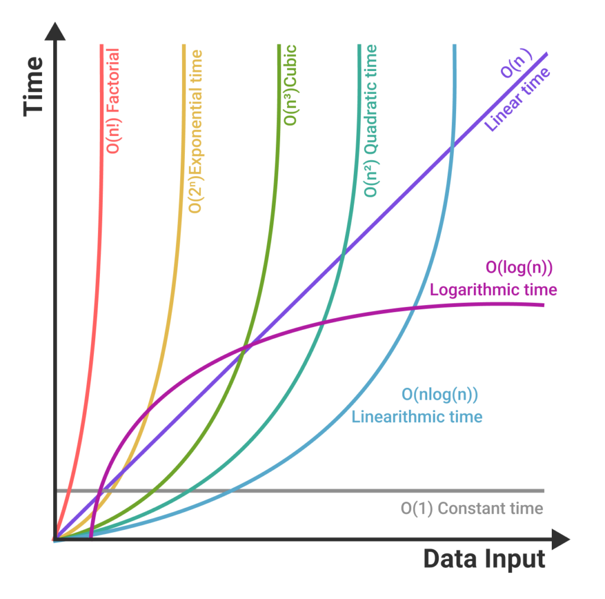

## List in Python
- In Python, a list is a **data structure** used to store a **collection** of items, typically of the same or different data types. 
- Lists are one of the most commonly used data structures in Python.
- They are defined by enclosing a comma-separated sequence of items within square brackets `[ ]`. 
- Here's a basic example of a Python list:
```python
my_list = [1, 2, 3, 4, 5]
names = ["Alice", "Bob", "Charlie"]
mixed_list = [1, "Alice", 3.14, True]
```

## Key Characteristics of lists in Python:
1. **Dynamic Size:** 
    - Unlike arrays in some other languages, Python lists are dynamic. 
    - They can grow or shrink in size as needed, which means you can add or remove items after the list has been created.
    ```python
    # Creating an empty list
    my_list = []
    
    # Adding elements
    my_list.append(10)
    my_list.append(20)
    my_list.append(30)
    print("List after adding elements:", my_list)  # [10, 20, 30]
    
    # Removing an element
    my_list.remove(20)
    print("List after removing an element:", my_list)  # [10, 30]
    ```
2. **Heterogeneous Elements:** 
    - Lists can contain items of different types, including numbers, strings, other lists, or any other type of object. 
    - This flexibility is one of the key features that make lists so powerful in Python.
    ```python
    # Creating a heterogeneous list
    mixed_list = [42, "hello", [3, 4, 5], {'a': 1, 'b': 2}]
    print("A heterogeneous list:", mixed_list)  # [42, 'hello', [3, 4, 5], {'a': 1, 'b': 2}]
    ```
3. **Ordered:** 
    - Python lists are ordered, meaning that the items have a specific, fixed order. 
    - This order is determined by the sequence in which you add items to the list. 
    - The first item you add is the first item in the list, and so on.
    ```python
    # Creating an ordered list
    ordered_list = ['first', 'second', 'third']
    print("Ordered list:", ordered_list)  # ['first', 'second', 'third']
    ```
4. **Mutable:** 
    - Lists are mutable, meaning you can modify them after their creation. 
    - This includes changing, adding, and removing elements.
    - In the below example, the list `my_list` undergoes various changes, yet its `id()` remains constant, illustrating its mutability.
    ```python
    # Creating a list
    my_list = [1, 2, 3]
    print("Original List:", my_list)  # [1, 2, 3]
    print("Original ID:", id(my_list))  # 1600521818496
    
    # Modifying an element
    my_list[0] = 10
    print("\nList After Modification:", my_list)  # [10, 2, 3]
    print("ID After Modification:", id(my_list))  # 1600521818496
    
    # Adding an element
    my_list.append(4)
    print("\nList After Adding an Element:", my_list)  # [10, 2, 3, 4]
    print("ID After Adding an Element:", id(my_list))  # 1600521818496
   
    # Removing an element
    my_list.remove(2)
    print("\nList After Removing an Element:", my_list)  # [10, 3, 4]
    print("ID After Removing an Element:", id(my_list))  # 1600521818496
    
    # In-place sorting
    my_list.sort()
    print("\nList After Sorting:", my_list)  # [3, 4, 10]
    print("ID After Sorting:", id(my_list))  # 1600521818496
    ```
  
## Accessing List Elements
1. Indexing
2. Slicing

### 1. Indexing in Python Lists
- Indexing is a fundamental concept in Python, allowing you to access individual elements of a list. 
- **Basic Indexing:** In Python, lists are zero-indexed, meaning the first element is at index 0, the second at 1, and so on.
- **Negative Indexing:** Python also supports negative indexing, where -1 refers to the last item, -2 to the second-last, and so on.
- **Index Errors**  `Out of Range:` Attempting to access an index that is out of the range of the list will result in an `IndexError`.
```python 
my_list = ['Python', 'Java', 'C++', 'JavaScript']

# Basic Indexing
print(my_list[0])  # Outputs 'Python'
print(my_list[2])  # Outputs 'C++'

# Negative Indexing
print(my_list[-1])  # Outputs 'JavaScript' - Accesses the last element
print(my_list[-2])  # Outputs 'C++' - Accesses the second-to-last element

# Index Errors
# This will raise an IndexError if uncommented
# print(my_list[4])
```

### 2. Slicing in Python Lists
- List slicing in Python is a powerful way to access elements of a list. 
- It allows you to extract portions of a list using a simple and readable syntax. 
- The basic form of list slicing is **list[start:end:step]**, where start, end, and step are integers. 
- Here's a breakdown of each component:
  - **Start:** 
    - The starting index of the slice. 
    - If omitted, slicing starts from the beginning of the list (index 0).
  - **End:** 
    - The ending index of the slice. 
    - The slice goes up to, but does not include, the element at this index. 
    - If omitted, slicing goes to the end of the list.
  - **Step:** 
    - The step size of the slicing. 
    - If omitted, the step size is 1, which means every element between start and end is included. 
    - A step size of 2 means every second element is included, and so on. 
    - A negative step size can be used to reverse the list.
```python
# Define a sample list
my_list = [0, 1, 2, 3, 4, 5, 6, 7, 8, 9]

# Basic slicing from index 2 to 5 (excluding 5)
# This slices the list from the 3rd element to the 5th, not including the 5th
slice1 = my_list[2:5]
print("Basic slice from index 2 to 5:", slice1)  # Output: [2, 3, 4]

# Slicing from the start of the list up to (but not including) index 3
# When start index is omitted, it defaults to 0 (beginning of the list)
slice2 = my_list[:3]
print("Slice from start to index 3:", slice2)  # Output: [0, 1, 2]

# Slicing from index 3 to the end of the list
# When end index is omitted, it extends to the end of the list
slice3 = my_list[3:]
print("Slice from index 3 to end:", slice3)  # Output: [3, 4, 5, 6, 7, 8, 9]

# Negative indexing to access elements from the end
# -1 represents the last element, -2 the second-last, and so on
last_element = my_list[-1]
print("Accessing the last element:", last_element)  # Output: 9

# Reversing the list using slicing
# start and end are omitted, step is -1, which reverses the list
reversed_list = my_list[::-1]
print("Reversed list:", reversed_list)  # Output: [9, 8, 7, 6, 5, 4, 3, 2, 1, 0]

# Slicing with a step size
# The step size determines the interval between each element in the slice
# Here, a step size of 2 takes every second element
every_second_element = my_list[::2]
print("Every second element:", every_second_element)  # Output: [0, 2, 4, 6, 8]

# Using negative step size
# This example starts from index 8 and moves backwards two steps at a time
negative_step_slice = my_list[8:2:-2]
print("Negative step slice:", negative_step_slice)  # Output: [8, 6, 4]
```

## Modifying Elements
- **Adding Elements:** Using `append()`, `extend()`, and `insert()` methods.
- **Removing Elements:** Using `remove()`, `pop()`, and `del` keyword.

```python
# Initializing a List of Integers
my_list = [0, 1, 2, 3, 4, 5, 6, 7, 8, 9, 10]
print("Original List:", my_list)  # [0, 1, 2, 3, 4, 5, 6, 7, 8, 9, 10]

# Adding Elements
# - append(): Adds an item to the end of the list.
#   - It can only add one item at a time.
#   - If you try to append an iterable, it will be added as a single element.
my_list.append(11)
print("After append:", my_list)  # [0, 1, 2, 3, 4, 5, 6, 7, 8, 9, 10, 11]

# Try appending an empty list - it adds the empty list as one element
my_list.append([])
print("After append (with empty list):", my_list)  # [0, 1, 2, 3, 4, 5, 6, 7, 8, 9, 10, 11, []]

# - extend(): Extends the list by adding all items of an iterable (e.g., another list) to the end.
#   - It can add multiple items from an iterable.
#   - If you try to extend with a non-iterable, it will raise an error.
another_list = [14, 15]
my_list.extend(another_list)
print("After extend:", my_list)  # [0, 1, 2, 3, 4, 5, 6, 7, 8, 9, 10, 11, [], 14, 15]

# Try extending with a non-iterable (integer) - it will raise an error
# my_list.extend(16)  # Uncomment this line to see the error

# - insert(): Inserts an item at a specified index.
my_list.insert(2, 16)
print("After insert:", my_list)  # [0, 1, 16, 2, 3, 4, 5, 6, 7, 8, 9, 10, 11, [], 14, 15]

# Removing Elements
# - remove(): Removes the first occurrence of a specified value.
#   - If the element is not in the list, it raises a ValueError.
my_list.remove(3)
print("After remove:", my_list)  # [0, 1, 16, 2, 4, 5, 6, 7, 8, 9, 10, 11, [], 14, 15]

# Try removing a non-existent element - it will raise an error
# my_list.remove(20)  # Uncomment this line to see the error

# - pop(): Removes and returns an item at a given index (default is the last item).
# With an index: When used with an index, pop(index) removes and returns the item at the specified index.
#   - If the list is empty or the index is out of range, it raises an IndexError.
popped_item = my_list.pop()
print("After pop:", my_list)  # [0, 1, 16, 2, 4, 5, 6, 7, 8, 9, 10, 11, [], 14]
print("Popped Item:", popped_item)  # 15

# Try popping an empty list - it will raise an error
# empty_list = []
# empty_list.pop()  # Uncomment these lines to see the error

# - del Keyword: Removes the item at a specified index.
#   - If the index is out of range, it raises an IndexError.
del my_list[5]  # Remove item at index 5
print("After del:", my_list)  # [0, 1, 16, 2, 4, 6, 7, 8, 9, 10, 11, [], 14]

# Try deleting a non-existent index - it will raise an error
# del my_list[20]  # Uncomment this line to see the error
```

### append() vs extend()
- **_append() adds its argument as a single element to the end of a list, while extend() unpacks its argument adding each element to the list._**
- The choice between the two methods depends on whether you want to add the entire object as a single item (append()) or merge it into the existing list (extend()).


- **append() Method:**
  ```python
  my_list = [1, 2, 3]
  my_list.append([4, 5])
  # Here, [4, 5] is added as a single item to my_list.
  print(my_list)  # Output: [1, 2, 3, [4, 5]]
  ```
- **extend() Method:**
  ```python
  my_list = [1, 2, 3]
  my_list.extend([4, 5])
  # Here, each element of [4, 5] is added individually to my_list.
  print(my_list)  # Output: [1, 2, 3, 4, 5]
  ```

## Iterating through Lists
### 1. Using for Loops with Lists
- A `for` loop in Python is commonly used to iterate over the elements of a list. 
```python
fruits = ['apple', 'banana', 'cherry']
for fruit in fruits:
    print(fruit)

# apple
# banana
# cherry
```
- In this example, the `for` loop iterates through each element in the fruits list, and the `print()` function is used to output each fruit.

### 2. Iterating with a while Loop and Index
- While `for` loops are more common for iterating through lists, you can also use a `while` loop along with an index. This method is a bit more verbose but can be useful in certain scenarios. Here's how it works:

```python
fruits = ['apple', 'banana', 'cherry']
i = 0
while i < len(fruits):
    print(fruits[i])
    i += 1

# apple
# banana
# cherry
```
- In this example, `i` is used as an index to access each element of the list. 
- The `while` loop runs as long as i is less than the length of the list.
---
## Common List Operations
### Sorting and Reversing
1. **sort()** sorts the list in place and alters the original list.
2. **sorted()** creates a new sorted list without changing the original list.
3. **reverse()** reverses the list in place and alters the original list.
4. **reversed()** returns an iterator for the list in reverse order without altering the original list. ​

```python
# Creating a sample list
original_list = [3, 1, 4, 1, 5, 9, 2]

# Using sort() to sort the list in place in ascending order
original_list.sort()
# After using sort(), original_list is permanently altered
print("After sort():", original_list)  # After sort(): [1, 1, 2, 3, 4, 5, 9]

# Using sorted() to create a new sorted list, leaving the original list unchanged
# Let's first reset original_list to its initial state
original_list = [3, 1, 4, 1, 5, 9, 2]
sorted_list = sorted(original_list)
# sorted() doesn't change original_list; it creates a new sorted list
print("Original list:", original_list)  # Original list: [3, 1, 4, 1, 5, 9, 2]
print("After sorted():", sorted_list)  # After sorted(): [1, 1, 2, 3, 4, 5, 9]

# Using reverse() to reverse the elements of the list in place
original_list.reverse()
# After using reverse(), original_list is permanently reversed
print("After reverse():", original_list)  # After reverse(): [2, 9, 5, 1, 4, 1, 3]

# Using reversed() to get an iterator for iterating over the list in reverse order
# Let's first reset original_list to its initial state
original_list = [3, 1, 4, 1, 5, 9, 2]
# reversed() doesn't change original_list; it creates an iterator
reversed_iterator = reversed(original_list)
# Converting the iterator to a list for display purposes
reversed_list = list(reversed_iterator)  
print("Original list:", original_list)  # Original list: [3, 1, 4, 1, 5, 9, 2]
print("After reversed():", reversed_list)  # After reversed(): [2, 9, 5, 1, 4, 1, 3]
```

### Other Common Functions
```python
# Creating a sample list
sample_list = [3, 1, 4, 1, 5, 9, 2]

# Using len() to get the length of the list
length = len(sample_list)
# len() returns the number of items in a container
print("Length of the list:", length)  # Length of the list: 7

# Using max() to find the maximum value in the list
maximum = max(sample_list)
# max() returns the largest item in an iterable or the largest of two or more arguments
print("Maximum value in the list:", maximum)  # Maximum value in the list: 9

# Using min() to find the minimum value in the list
minimum = min(sample_list)
# min() returns the smallest item in an iterable or the smallest of two or more arguments
print("Minimum value in the list:", minimum)  # Minimum value in the list: 1

# Using sum() to calculate the total of the elements in the list
total = sum(sample_list)
# sum() adds the items of an iterable from left to right and returns the total
print("Sum of all elements in the list:", total)  # Sum of all elements in the list): 25

# Counting occurrences of an element using count()
# Counting how many times '1' appears in the list
count_1 = sample_list.count(1)
print("Occurrences of '1' in the list):", count_1)  # Occurrences of '1' in the list): 2

# Finding the index of an element using index()
# Finding the index of the first occurrence of '4' in the list
index_4 = sample_list.index(4)
print("Index of '4' in the list):", index_4)  # Index of '4' in the list: 2
```
---
### List Concatenation and Repetition

```python
# List Concatenation and Repetition

# List Concatenation:
# Concatenation is the process of combining two lists into one.
# It's done using the '+' operator.

# Define two lists
list1 = [1, 2, 3]
list2 = [4, 5, 6]

# Concatenate the lists
combined_list = list1 + list2

# The combined_list now contains elements of both list1 and list2.
print("Concatenated List:", combined_list)  # Concatenated List: [1, 2, 3, 4, 5, 6]

# List Repetition:
# Repetition is the process of repeating elements of a list a specified number of times.
# It's done using the '*' operator.

# Define a list
list3 = ['a', 'b', 'c']

# Repeat the list
repeated_list = list3 * 3

# The repeated_list contains elements of list3 repeated 3 times.
print("Repeated List:", repeated_list)  # Repeated List: ['a', 'b', 'c', 'a', 'b', 'c', 'a', 'b', 'c']
```
---
## Nested Lists
```python
# Creating a nested list (a list of lists)
nested_list = [[1, 2, 3], [4, 5, 6], [7, 8, 9]]

# Accessing elements in a nested list
# Accessing the first list
first_list = nested_list[0]  # This will be [1, 2, 3]
# Accessing the first element of the first list
first_element = nested_list[0][0]  # This will be 1

# Displaying accessed elements
print("First list:", first_list)  # First list: [1, 2, 3]
print("First element of the first list:", first_element)  # First element of the first list: 1

# Modifying elements in nested lists
# Changing the second element of the first list to 10
nested_list[0][1] = 10  # The first list now becomes [1, 10, 3]

# Adding a new element to the second list
nested_list[1].append(7)  # The second list now becomes [4, 5, 6, 7]

# Displaying the modified nested list
print("Modified nested list:", nested_list)  # Modified nested list: [[1, 10, 3], [4, 5, 6, 7], [7, 8, 9]]
```
---
## Copying Lists in Python

### Direct Assignment:

```mathematica
Original Box (Memory Address: 0x100)
+-----------+
| Box 1     | 
| Box 2     | 
| Box 3     | 
+-----------+
New Label for Original Box (Memory Address: 0x100)
+-----------+
| Box 1     | 
| Box 2     | 
| Box 3     | 
+-----------+

Both Original Box and New Label share the same memory address (0x100), indicating they are the same box.
```

### Shallow Copy:
- A shallow copy just copies the references to these objects.
- It doesn't create copies of the objects contained in the original list.
- Changes in deeply nested objects in the original list will be reflected in the shallow copy.
```
Original Box:
Original Box (Memory Address: 0x100)
+-----------+
| Box 1     | 
| Box 2     | 
| Box 3     | 
+-----------+

Shallow Copy Box (Memory Address: 0x200)
+----------------+
| [Ref to Box 1] | -----> (Memory Address: 0x101)
| [Ref to Box 2] | -----> (Memory Address: 0x102)
| [Ref to Box 3] | -----> (Memory Address: 0x103)
+----------------+
Note: Shallow Copy Box has a different memory address (0x200), but the elements inside reference the same addresses as those in the Original Box.
```

### Deep Copy:
- A deep copy creates a new list and recursively adds copies of the objects found in the original list. 
- Changes in the original list will not affect the deep copy.
```
Original Box:
Original Box (Memory Address: 0x100)
+-----------+
| Box 1     | 
| Box 2     | 
| Box 3     | 
+-----------+

Deep Copy Box (Memory Address: 0x300)
+-------------+
| Copy of Box 1 | -----> (Memory Address: 0x301)
| Copy of Box 2 | -----> (Memory Address: 0x302)
| Copy of Box 3 | -----> (Memory Address: 0x303)
+-------------+
Note: Deep Copy Box and its elements have entirely different memory addresses (0x300, 0x301, 0x302, 0x303), 
      indicating that they are completely separate from the Original Box and its contents.
```

```python
import copy

# Creating an original list with a nested list inside
original_list = [1, 2, [3, 4]]
# Displaying the original list and its memory ID
print("Original List:", original_list, "| ID:", id(original_list))  # [1, 2, [3, 4]] | ID: 1856962495872

# Creating a new list by direct assignment
new_list = original_list
# The ID will be the same as the original list because it's not a copy, but another reference to the same list.
print("New List (direct assignment):", new_list, "| ID:", id(new_list))  # [1, 2, [3, 4]] | ID: 1856962495872

# Creating a shallow copy using slicing
shallow_copied_list = original_list[:]
# Note: The ID will be different, as slicing creates a new list object. However, the nested list inside remains the same object.
print("Shallow Copied List (slicing):", shallow_copied_list, "| ID:", id(shallow_copied_list))  # [1, 2, [3, 4]] | ID: 1856963694528

# Creating shallow copy using copy() method
shallow_copied_list2 = original_list.copy()
# Note: Similar to slicing, the copy() method creates a new list object, but the nested list inside is still the same object.
print("Shallow Copied List (copy()):", shallow_copied_list2, "| ID:", id(shallow_copied_list2))  # [1, 2, [3, 4]] | ID: 1856963711296

# Creating a deep copy using copy.deepcopy()
deep_copied_list = copy.deepcopy(original_list)
# Note: deepcopy creates a completely new list object with new nested objects, so both the list and its nested list have different IDs.
print("Deep Copied List:", deep_copied_list, "| ID:", id(deep_copied_list))  # ID: 1856963711360

# Modifying the nested list inside the original list
original_list[2][0] = 'Changed'

# Displaying the modified original list and its memory ID
print("Modified Original List:", original_list, "| ID:", id(original_list))  # [1, 2, ['Changed', 4]] | ID: 1856962495872

# Displaying the new list (created by direct assignment) after modification of the original list
# Note: The new list reflects the changes made to the original list, as it is the same object (same ID).
print("New List (direct assignment) After Modification:", new_list, "| ID:", id(new_list))  # [1, 2, ['Changed', 4]] | ID: 1856962495872

# Displaying the shallow copied list (slicing) after modification of the original list
# Note: The shallow copy reflects changes in the nested list because it shares the same nested object (same ID for the nested list).
print("Shallow Copied List (slicing) After Modification:", shallow_copied_list, "| ID:", id(shallow_copied_list))  # [1, 2, ['Changed', 4]] | ID: 1856963694528

# Displaying the shallow copied list (copy()) after modification of the original list
# Note: Similar to slicing, this shallow copy also shares the same nested list object, so changes in the original are reflected here.
print("Shallow Copied List (copy()) After Modification:", shallow_copied_list2, "| ID:", id(shallow_copied_list2))  # [1, 2, ['Changed', 4]] | ID: 1856963711296

# Displaying the deep copied list after modification of the original list
# Note: The deep copy does not reflect the changes as it is an entirely separate object with its own nested objects.
print("Deep Copied List After Modification:", deep_copied_list, "| ID:", id(deep_copied_list))  # [1, 2, [3, 4]] | ID: 1856963711360
```
---
## List Manipulation Techniques

### List unpacking:
- List unpacking allows you to assign elements of a list to multiple variables

### Using zip() with lists
- `zip()` is used to combine elements from two or more iterables (like lists) 
- It pairs elements with the same index together into tuples

```python
# List unpacking
numbers = [1, 2, 3]
a, b, c = numbers  # a = 1, b = 2, c = 3
print(f"Unpacked Numbers: {a}, {b}, {c}")  # Unpacked Numbers: 1, 2, 3

# Using zip() with lists
list1 = [1, 2, 3]
list2 = ['a', 'b', 'c']
zipped = zip(list1, list2)  # Creates an iterable of tuples: (1, 'a'), (2, 'b'), (3, 'c')
print(f"Zipped List: {list(zipped)}")  # Zipped List: [(1, 'a'), (2, 'b'), (3, 'c')]
```

## Functional Programming with Lists
- Functional Programming with Lists refers to the programming paradigm that treats computation as the evaluation of mathematical functions and avoids changing-state and mutable data. 
- It emphasizes the use of functions (like map, filter, and reduce) and immutable data structures (like lists that don’t get modified in place).

### Using map(), filter(), and reduce() with lists
- map(), filter(), and reduce() are fundamental functions in functional programming, especially when working with lists. 
- They each serve a different purpose:
- **map() Function:** 
  - This function applies a given function to each item of an iterable (like a list) and returns a list of the results. 
  - The original list is not changed.
- **filter() Function:** 
  - This function constructs an iterator from elements of an iterable for which a function returns true. 
  - In other words, it filters out elements of a list that don't satisfy a certain condition.
- **reduce() Function:** 
  - The `reduce` function takes two arguments: 
    - a function and 
    - an iterable (like a list). 
  - The function itself must accept two arguments. The process reduce follows is:
    1. It applies the function to the first two elements in the iterable, producing a result.
    2. This result is then used as one of the inputs in the next application of the function, along with the next element in the iterable.
    3. This process continues until the iterable is exhausted, and reduce returns a single cumulative value.


```python
numbers = [1, 2, 3, 4, 5]
squared_numbers = []

def square(num):
    return num * num

# Traditional Way (Using for loop)
for num in numbers:
    s = square(num)
    squared_numbers.append(s)
print(squared_numbers)  # [1, 4, 9, 16, 25]

# Using map() Function
squared_numbers = list(map(square, numbers))
print(squared_numbers)  # [1, 4, 9, 16, 25]
```
```python
def is_even(num):
    return num % 2 == 0

numbers = [1, 2, 3, 4, 5]
even_numbers = []

# Traditional Way (Using For Loop):
for num in numbers:
    if is_even(num):
        even_numbers.append(num)
print(even_numbers)  # [2, 4]

# Using filter() Function
even_numbers = list(filter(is_even, numbers))
print(even_numbers)  # [2, 4]
```

```python
from functools import reduce
def add(x, y):
    return x + y

numbers = [1, 2, 3, 4, 5]
sum_of_numbers = 0

# Traditional Way (Using For Loop):
for num in numbers:
    sum_of_numbers += num
print(sum_of_numbers)  # 15

# Use reduce to sum up all numbers
sum_of_numbers = 0  # reset sum to zero  
sum_of_numbers = reduce(add, numbers)
print(sum_of_numbers)  # 15
# Step-by-Step Breakdown:
# 
# Initially, reduce takes the first two elements in numbers (1 and 2) and applies the add function to them, resulting in 3.
# Then, it takes this result (3) and applies add with the next element in numbers (also 3), resulting in 6.
# This process continues with the next elements 4 and 5.
# 
# Step 1: add(1, 2) → returns 3
# Step 2: add(3, 3) → returns 6
# Step 3: add(6, 4) → returns 10
# Step 4: add(10, 5) → returns 15
# At the end of these steps, reduce will return 15, which is the sum of all the numbers in the list.
```
---
## List Performance

### Complexity and Big O Notation:
- Complexity in computer science refers to how the resource usage (time or memory) of an algorithm scales with input size.
- **Big O Notation** is a mathematical notation used to describe the upper limit of an algorithm's complexity. It focuses on the **worst-case scenario**.
- Other notations include **Big Theta (Θ)**, which describes the **exact bound**, and **Big Omega (Ω)**, for the **lower bound**. 
- However, Big O is the most commonly used because it provides a useful simplification for analyzing worst-case scenarios.
- We use Big O because it offers a high-level understanding of an algorithm's efficiency, allowing developers to make informed decisions about algorithm choice and optimization.

### Time Complexity: 
- It measures how the execution time of an algorithm increases with the size of the input.
- It's crucial for predicting how algorithms perform as data scales, helping in writing efficient code.
- Common Time Complexities:
  1. **Constant Time (O(1)):** The execution time is constant and does not depend on the input size.
  2. **Linear Time (O(n)):** The execution time grows linearly with the input size.
  3. **Logarithmic Time (O(log n)):** The execution time grows logarithmically with the input size, common in divide-and-conquer algorithms.
  4. **Quadratic Time (O(n²)):** The execution time grows quadratically with the input size, often seen in nested loops.
  5. **Polynomial Time (O(n^k)):** Generalization of quadratic and cubic times.
  6. **Exponential Time (O(2^n)):** The execution time doubles with each addition to the input data set.
  7. **Factorial Time (O(n!)):** The execution time grows with the factorial of the input size, often seen in algorithms that generate all permutations of the input.
### Space complexity:
- It refers to the amount of memory an algorithm needs in relation to the size of its input.
- It helps in evaluating how an algorithm utilizes memory, which is vital in memory-constrained environments.
- Space complexity can be constant (O(1)), linear (O(n)), quadratic (O(n²)), etc., depending on how additional memory usage grows with input size.

### Time Complexity of Common List Operations
- **Indexing and Assigning to an Index Position: O(1)**
  - Accessing or changing an element at a specific position is very fast as lists are implemented as arrays.
- **Appending: O(1)**
  - Adding an element to the end of the list is typically very fast. 
  - However, it can occasionally be slower if the list needs to resize.
- **Inserting or Removing at the Beginning or Middle: O(n)**
  - Inserting or removing elements not at the end requires shifting all subsequent elements, which becomes more costly as the list grows.
- **Length Retrieval: O(1)**
  - Finding out the number of items in a list is a constant time operation.
- **Slicing: O(k)**
  - Creating a slice of k elements has a cost linear to the number of elements being sliced.
- **Containment Check (x in list): O(n)**
  - Checking if an item is in a list requires scanning each element until a match is found or the end is reached.
- **Iteration: O(n)**
  - Iterating over each element of the list has a linear time complexity relative to the list's size.
- **Sorting: O(n log n)**
  - Python uses `Timsort` for sorting lists, which is very efficient for practical use cases.

---
## List Comprehensions
- List comprehensions are a concise way to create lists in Python. 
- They provide a shorter syntax when you want to create a new list based on the values of an existing list. 
- List comprehensions are generally more compact and faster than normal functions and loops for creating lists.

Here's the basic structure of a list comprehension:

```python
new_list = [expression for item in iterable if condition == True]
```
- **expression:** This is the current item in the iteration, but it is also the outcome, which you can manipulate before it ends up like an item in the new list.
- **for item in iterable:** The for-loop over the iterable (like list, tuple, set, etc.) that iterates through each item in the iterable.
- **if condition == True:** This is optional. If provided, it tests a condition on each item in the iterable. Only if the condition is true will the item be included in the new list.

### Examples
#### Simple List Comprehension:
```python
# Create a list of squares for integers from 0 to 9 using a loop
# squares = []
# for x in range(10):
#     squares.append(x**2)
# Create a list of squares for integers from 0 to 9 using list comprehension
squares = [x**2 for x in range(10)]
# [0, 1, 4, 9, 16, 25, 36, 49, 64, 81]
```

#### List Comprehension with If Condition:
```python
# Create a list of squares for even integers from 0 to 9 using a loop
# even_squares = []
# for x in range(10):
#     if x % 2 == 0:
#         even_squares.append(x**2)
# Create a list of squares for even integers from 0 to 9 using list comprehension
even_squares = [x**2 for x in range(10) if x % 2 == 0]
# [0, 4, 16, 36, 64]
```
#### Using Multiple For Loops:
```python
# Create a list of tuples (x, y) using nested loops
# pairs = []
# for x in range(3):
#     for y in range(3):
#         pairs.append((x, y))
#
# Create a list of tuples (x, y) using list comprehension
pairs = [(x, y) for x in range(3) for y in range(3)]
# [(0, 0), (0, 1), (0, 2), (1, 0), (1, 1), (1, 2), (2, 0), (2, 1), (2, 2)]
```
- List comprehensions are a powerful feature of Python that make code more readable and often more efficient. 
- However, for very complex operations, using regular for loops or functions might be more readable.

---

## Assignments
1. List Basics:
  - Create a list of your favorite fruits and print its elements.
  - Write a program to find the length of a list without using the len() function.
2. List Manipulation:
  - Write a program that takes a list of numbers and prints the sum of all the numbers.
  - Given two lists, write a program to merge them into a single list.
3. List Operations:
  - Create a list of numbers and find the maximum and minimum values in the list.
  - Write a program to count the occurrences of a specific element in a list.
4. List Iteration:
  - Write a program to iterate through a list of names and print each name with a greeting message.
  - Given a list of numbers, find and print all the even numbers.
5. List Slicing:
  - Take a list of words and print the first three words.
  - Write a program to reverse a list using list slicing.
6. List Comprehensions:
  - Generate a list of squares of numbers from 1 to 10 using a list comprehension.
  - Filter a list of numbers to create a new list of only even numbers using list comprehension.
7. List Sorting:
  - Sort a list of names in alphabetical order.
  - Sort a list of numbers in descending order.
8. List Manipulation Functions:
  - Implement a function that takes a list of integers and returns a new list with all duplicates removed.
  - Implement a function that takes two lists and returns a new list containing common elements between the two lists.
9. List Challenges:
  - Write a program to find the second-largest element in a list.
10. List Operations with User Input:
  - Write a program that takes user input to create a list and then finds the sum of its elements.
