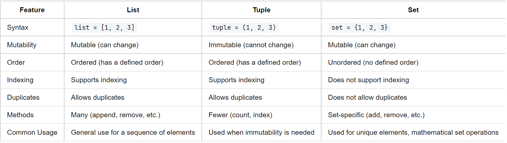

# Tuples

## Definition and Characteristics of Tuples:
1. **Immutable:** 
  - Once a tuple is created, its elements cannot be changed, added, or removed. 
  - This immutability makes tuples a secure choice for fixed data storage.
2. **Ordered:** 
  - Tuples maintain the order of elements in which they were defined. 
  - Each element has a specific position, which can be accessed by indexing.
3. **Indexable and Iterable:** 
  - Elements in a tuple can be accessed by their index, and you can iterate through a tuple using a loop.
4. **Allow Duplicate Elements:** 
  - Tuples can contain multiple instances of the same value.
5. **Heterogeneous:** 
  - They can store different types of data (e.g., integers, strings, lists, other tuples).
```python
# Creating a tuple with mixed data types
# Tuples are defined using parentheses ( ) and elements are separated by commas
my_tuple = (1, "Hello", 3.14, "Apple", 1)
# This tuple contains an integer, a string, a float, another string, and an integer

# Tuples are immutable
# Attempting to change an element will result in an error
# Uncommenting the line below will raise a TypeError
# my_tuple[1] = "World"

# Tuples are ordered
# The order in which you enter the elements will be preserved
print("Original tuple:", my_tuple)

# Tuples are indexable
# Accessing the first element (index 0)
print("First element:", my_tuple[0])

# Tuples are iterable
# You can iterate through each element in a tuple using a for loop
print("Iterating through the tuple:")
for element in my_tuple:
    print(element)

# Tuples allow duplicate elements
# The integer 1 appears twice in this tuple
print("Count of 1 in tuple:", my_tuple.count(1))

# Tuples can store heterogeneous (different types of) data
# This tuple contains integers, strings, and a float
print("Types in tuple:")
for element in my_tuple:
    print(type(element))
```

## Creating Tuples:
1. **With Parentheses:** 
  - This is the most common way to create a tuple.
  - Tuples are typically defined by enclosing elements in parentheses `( )`, separated by commas. 
  - For example, `my_tuple = (1, "Hello", 3.14)`
2. **Without Parentheses:** 
  - They can also be created without parentheses, by just separating items with commas, like `my_tuple = 1, "Hello", 3.14`
  - Parentheses are optional for tuples.
  - Simply separating items with commas is enough to create a tuple.
3. **Singleton Tuple:** 
  - This is used for creating a tuple with a single element
  - A comma is required after the item to distinguish it from a regular expression.
  - That is - a tuple with a single element must include a comma after the item, e.g., `singleton_tuple = (1,)`
```python
my_tuple = (1, "Hello", 3.14)
print(type(my_tuple))  # <class 'tuple'>
print(my_tuple)        # (1, 'Hello', 3.14)

# Tuple creation without parentheses
my_tuple = 1, "Hello", 3.14
print(type(my_tuple))  # <class 'tuple'>
print(my_tuple)        # (1, 'Hello', 3.14)

# Creating a singleton tuple
singleton_tuple = (1,)
print(type(my_tuple))   # <class 'tuple'>
print(singleton_tuple)  # (1,)

# Without a comma, it's just a number in parentheses
num_in_parentheses = (1)
print(type(num_in_parentheses))  # <class 'int'>
print(num_in_parentheses)        # 1
```
## Accessing Tuple Elements:
1. **Indexing:** 
  - Elements in a tuple can be accessed using their index, with the first element at index 0. 
  - For example, my_tuple[0] would access the first element.
2. **Negative Indexing:** 
  - Access elements from the end of the tuple using negative indices, where -1 represents the last element.
3. **Nested Tuples:**
  - If a tuple contains another tuple, you can access its elements using nested indexing, like my_tuple[1][2].
```python
# Create a tuple with some sample data
my_tuple = (1, 2, 3, ("a", "b", "c"))

# 1. Indexing: Access elements in a tuple using positive indices
first_element = my_tuple[0]  # Access the first element (1)
print(first_element)         # 1

# 2. Negative Indexing: Access elements from the end using negative indices
last_element = my_tuple[-1]    # Access the last element, which is a nested tuple (("a", "b", "c"))
print(last_element)            # ('a', 'b', 'c')

# 3. Nested Tuples: Access elements inside a nested tuple using nested indexing
nested_element = my_tuple[3]           # Access the nested tuple
print(nested_element)                  # ('a', 'b', 'c')
nested_first_element = my_tuple[3][0]  # Access the first element of the nested tuple
print(nested_first_element)            # a
```
## Basic Operations:
1. **Slicing:** Extract a portion of a tuple using the slice operation, specifying a start and end index, like `my_tuple[1:3]`
2. **Concatenation:** Combine tuples using the + operator, like tuple1 + tuple2.
3. **Repetition:** Repeat elements in a tuple using the * operator, like my_tuple * 3.
4. **Membership Test:** Check if an item exists in a tuple with the in keyword.
5. **Common Methods:** Tuple supports common methods like `count()`, `index()`
 
```python
# Creating a tuple
my_tuple = (0, 1, 2, 3, 4, 5)

# 1. Slicing: Extract a portion of a tuple
# Get elements from index 1 (inclusive) to 3 (exclusive)
sliced_tuple = my_tuple[1:3]
print(sliced_tuple)  # Output: (1, 2)

# 2. Concatenation: Combine tuples
tuple1 = (1, 2)
tuple2 = (3, 4)
concatenated_tuple = tuple1 + tuple2
print(concatenated_tuple)  # Output: (1, 2, 3, 4)

# 3. Repetition: Repeat elements in a tuple
repeated_tuple = my_tuple * 2
print(repeated_tuple)  # Output: (0, 1, 2, 3, 4, 5, 0, 1, 2, 3, 4, 5)

# 4. Membership Test: Check if an item exists in a tuple
element_to_check = 3
if element_to_check in my_tuple:
    print(f"{element_to_check} exists in the tuple.")
else:
    print(f"{element_to_check} does not exist in the tuple.")  # Output: 3 exists in the tuple.


# 5. The count() method returns the number of times a specified value appears in the tuple.
my_tuple = (1, 2, 3, 'apple', 'banana', 2)
occurrences_of_two = my_tuple.count(2)
print(f"Number of times 2 appears: {occurrences_of_two}")

# 6. # The index() method finds the first occurrence of the specified value.
index_of_apple = my_tuple.index('apple')
print(f"Index of 'apple': {index_of_apple}")
```

## The Concept of Mutable Elements in Immutable Tuples 
- In Python, a tuple is a standard data type that's immutable, meaning once a tuple is created, you cannot alter which elements it contains. 
- This immutability refers to the structure of the tuple itself, not necessarily the elements within it. 
- When a tuple contains mutable elements, such as lists, **they retain their mutability even when they're part of a tuple** - you can modify these elements. 
- For example, if a tuple contains a list, you can add, remove, or change items in that list. 
- However, you cannot change the fact that this specific list is part of the tuple. You can't replace it with another list or change the tuple's size.
```python
# Creating a tuple with a mutable element (list)
my_tuple = (1, 2, [3, 4])

# Displaying the initial state of the tuple and the IDs
print("Initial tuple:", my_tuple)                   # (1, 2, [3, 4])
print("ID of tuple:", id(my_tuple))                 # 1979865926464
print("ID of list inside tuple:", id(my_tuple[2]))  # 1979865636736 

# Modifying the mutable element (list) inside the tuple
my_tuple[2].append(5)  # Appending to the list

# Displaying the state of the tuple after modification and the IDs
print("\nModified tuple:", my_tuple)                                     # (1, 2, [3, 4, 5])
print("ID of tuple (after modification):", id(my_tuple))                 # 1979865926464 - unchanged
print("ID of list inside tuple (after modification):", id(my_tuple[2]))  # 1979865636736 - unchanged
```
## Tuples Unpacking and _ 
```python
# Define a function that returns a tuple containing various data types
def get_data():
    # This function returns a tuple with a string, a number, and a nested tuple
    return ("John", 25, ("Developer", "Python"))


name, age, job_details = get_data()  # Call the function and unpack the returned tuple
print(name, age, job_details)        # John 25 ('Developer', 'Python')

job_title, job_language = job_details  # job_details is a nested tuple. We can access its elements directly
print(job_title, job_language)         # Developer Python

# Using _ to ignore the age
name, _, (job_title, _) = get_data()            # Ignore age and job_language
print(f"Name: {name}, Job Title: {job_title}")  # Name: John, Job Title: Developer
```
---
# Sets
- A set is a fundamental concept in mathematics and computer science. 
- It is a **collection of distinct objects**, considered as an object in its own right. 
- Sets are characterized by the following properties:
  1. **Uniqueness:** Each element in a set is unique. There are no duplicate elements.
  2. **Unordered:** The elements in a set do not have a specific order. This means that `{1, 2, 3}` is the same as `{3, 2, 1}`.
- Sets are used in various fields for representing collections of unique items like numbers, characters, or even other sets.
- In Python, a set can be created using **Curly Braces** `{}` or the **set()** function. 
- Once created, the elements of the set will automatically ensure uniqueness and lose any order they might have had.

### Adding and Removing Elements
- **Adding Elements:** New elements can be added to a set, provided they are not already present.
- **Removing Elements:** Elements can be removed from a set. If an element doesn’t exist, the set remains unchanged.
- These operations allow for dynamic modification of the set's contents.

```python
# Creating a set in Python
my_set = {1, 2, 3}
print("Original Set:", my_set)  # {1, 2, 3}

# Adding an element to the set
# Since sets are unordered, the new element could appear anywhere in the set
my_set.add(4)
print("Set after adding an element:", my_set)  # {1, 2, 3, 4}

# Trying to add a duplicate element (which will have no effect)
my_set.add(2)
print("Set after trying to add a duplicate element:", my_set)  # {1, 2, 3, 4}

# Removing an element from the set
my_set.remove(3)
print("Set after removing an element:", my_set)  # {1, 2, 4}

# Attempting to remove an element not in the set (will raise a KeyError)
# my_set.remove(5)

# Another way to remove elements safely is using discard (no error if element is not found)
my_set.discard(5)  # No error even though 5 is not in the set
print("Set after discarding a non-existent element:", my_set)  # {1, 2, 4}
```

### Basic Set Operations
1. Union
2. Intersection
3. Difference
4. Symmetric difference
5. Subset
6. Superset
7. Disjoint

```python
# Set operations in Python

# Define two sets
A = {1, 2, 3, 4}
B = {3, 4, 5, 6}

# Union:
# The union of two sets is a set containing all elements from both sets.
# In Python, the union can be performed using the | operator or the .union() method.
union_set = A.union(B)  # or A | B
print("Union:", union_set)  # {1, 2, 3, 4, 5, 6}

# Intersection:
# The intersection of two sets is a set containing only the elements that are common to both sets.
# This operation can be performed using the & operator or the .intersection() method.
intersection_set = A.intersection(B)  # or A & B
print("Intersection:", intersection_set)  # {3, 4}

# Difference:
# The difference between two sets is a set containing elements that are in the first set but not in the second set.
# This is done using the - operator or the .difference() method.
difference_set = A.difference(B)  # or A - B
print("Difference (A-B):", difference_set)  # {1, 2}

# Symmetric Difference:
# The symmetric difference of two sets is a set containing elements that are in either of the sets but not in their intersection.
# It is performed using the ^ operator or the .symmetric_difference() method.
symmetric_difference_set = A.symmetric_difference(B)  # or A ^ B
print("Symmetric Difference:", symmetric_difference_set)  # {1, 2, 5, 6}

# Subset
# A set B is a subset of set A if all elements of B are also elements of A.
# This can be checked using the .issubset() method.
is_subset = B.issubset(A)
print("B is a subset of A:", is_subset)
C = {3, 4}
is_subset = C.issubset(A)
print("C is a subset of A:", is_subset)

# Superset:
# A set B is a superset of set A if all elements of A are also elements of B.
# This can be checked using the .issuperset() method.
is_superset = B.issuperset(A)
print("B is a superset of A:", is_superset)
C = {1, 2, 3, 4, 5, 6}
is_superset = C.issuperset(A)
print("C is a superset of A", is_superset)

# Disjoint: 
# Two sets are disjoint if they have no common elements. 
# This can be checked using the .isdisjoint() method.
is_disjoint = A.isdisjoint(B)
print("A and B are disjoint:", is_disjoint)
```

### Immutable Sets (Frozen Sets) in Python: Understanding frozenset
- In certain scenarios, we require sets to be immutable. 
- This is where `frozenset`, an immutable version of a set, comes into play.
- A frozenset is simply an immutable set. 
- Once you create a frozenset, you cannot add or remove elements from it. 
- This immutability makes frozensets hashable, allowing them to be used as keys in dictionaries or as elements in other sets, which is not possible with regular sets.

#### Key Features of frozenset:
- **Immutable:** Cannot be modified after creation.
- **Hashable:** Can be used as a dictionary key or set element.
- **Iterable:** Supports iteration, just like a regular set.
- **Unordered:** Does not maintain the order of elements.

```python
# Creating a regular set
regular_set = set([1, 2, 3])

# Creating a frozenset
immutable_set = frozenset([1, 2, 3])

# Adding an element to the regular set
regular_set.add(4)  # Works fine

# Trying to add an element to the frozenset (will raise an AttributeError)
try:
    immutable_set.add(4)
except AttributeError:
    print("Cannot add elements to a frozenset!")
```


