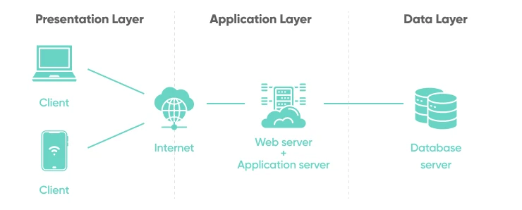
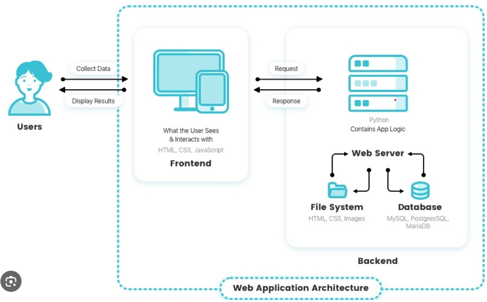

## Why Python?
- **Easy to Read and Learn:** Python is english-like language, clear and intuitive - ideal language for beginners.
- **Efficient Development:** Python's frameworks and libraries simplify and speed up the development process.
- **Cross-Platform Compatibility:** Python programs are generally written in a way that they can be run on any operating system without modification
- **Versatile:** Python's applications are vast, ranging from web development to data science, automation etc.
- **Popular**: Python's consistent evolution and its community-driven development have made it a popular choice for programmers.

  
 
## Uses of Python
- **Automation:**
  - **Scripting Daily Tasks:** 
    - Automating routine tasks like file organization, sending emails, or data entry.
    - _Google_ uses automated scripts written in Python to crawl the web and indexing pages for the Google Search engine.
  - **Web Scraping:** 
    - Extracting data from websites using libraries like BeautifulSoup etc.
    - _BuzzFeed_ uses Python for scraping web data to gather information for their news stories.
  - **Automated Testing:** 
    - Writing scripts for automated testing of software applications with frameworks like pytest.
    - _Netflix_ uses Python for automated testing of their application, ensuring reliability and performance.

- **Web and Application Development:**
  - **Web Frameworks:** 
    - Creating web applications using frameworks like Django and Flask.
    - _Pinterest_ uses Django, a Python framework, for website development.
  - **Microservices:** 
    - Developing microservices architectures with Flask or FastAPI.
    - _Uber_ uses Python to develop various microservices that power its complex transportation platform.
  - **API Development:** 
    - Building RESTful APIs for web services.
    - _Stripe_ uses Python for building powerful and efficient APIs for online payment processing.

- **Data Wrangling and Visualization:**
    - **Data Wrangling:** 
      - Manipulating and preparing data using Pandas.
      - _The New York Times_ uses Python, particularly Pandas, for data analysis and journalistic research.
    - **Data Visualization:** 
      - Creating visual data representations with tools like Matplotlib and Seaborn.
      - _The Jet Propulsion Laboratory (NASA)_ uses Python for visualizing data from space missions.

- **AI and Machine Learning:**
  - **Predictive Analytics:** 
    - Using libraries like scikit-learn for predictive modeling and data analysis.
    - _Amazon_ uses Python for customer segmentation and predicting future purchase patterns to enhance its recommendation system.
  - **Natural Language Processing (NLP):** 
    - Developing applications in NLP using libraries like NLTK(Natural Language Toolkit) and spaCy.
    - _Twitter_ leverages Python for analyzing and interpreting tweets to enhance user engagement and ad targeting.
  - **Neural Networks:** 
    - Building and training neural networks with TensorFlow or PyTorch for applications like image and speech recognition.
    - _Google DeepMind_ utilizes Python for developing neural networks in projects like AlphaGo.

  
- **Famous Examples:**
    - **Instagram:** Utilizing Django (a high-level Python web framework) to handle vast amounts of user data and interactions.
    - **Dropbox:** Built with Python to manage file storage and synchronization services.
    - **Spotify:** Leveraging Python for backend services and data analysis to enhance user experience and music recommendations.

## Exploring Web Development with Python

### User Interaction with the Website (Front-End):

- Users interact with the website through the front-end, which includes elements like buttons, forms, and navigation menus.
- Python's Role: Python is not commonly used for front-end development, it can serve data to front-end technologies and handle requests through frameworks like Django and Flask.
### Request to Web Server:
- Description: When a user performs an action (like clicking a button), a request is sent to the web server.
- Python's Role: Python-based web frameworks (**Django, Flask**) can be used to create web servers that receive and process these requests.
### Server-Side Logic (Back-End):
- The server processes the request, which may involve executing business logic, handling user inputs, or interacting with a database.
- Python's Role: Key Python frameworks and libraries include:
  - **Django**: A high-level Python web framework that encourages rapid development.
  - **Flask:** A micro web framework for Python making it ideal for smaller applications and microservices.
  - **FastAPI:** A modern, fast (high-performance) web framework for building APIs.
### Database Interaction:
- The server may need to retrieve or store data in a database based on the user's request.
- Python's Role: Python can interact with databases using libraries like **SQLAlchemy** or **Django ORM**, performing operations like querying or updating data.
### Integration with External APIs:
- The server might also interact with external services or APIs for additional functionalities, such as payment processing or fetching external data.
- Python's Role: Libraries like **requests** are commonly used for making HTTP requests to APIs in a straightforward manner. For more complex interactions, libraries such as **urllib3** or **httpx** offer advanced features.
### Processing and Response:
- After processing the request, the server sends a response back to the user's browser, which may include data to be rendered on the front-end.
- Python's Role: Django framework offers a comprehensive solution with its built-in **HttpResponse** class in the **django.http** module, which is used to manage responses. 
### Data Analysis and Machine Learning (If Applicable):
- Websites often collect data that can be used for analytics or machine learning purposes.
- Python's Role: Python shines in data analysis and machine learning with libraries like **Pandas, NumPy,** and frameworks like **TensorFlow,** enabling advanced functionalities like personalized recommendations.

## History of Python
- Python was created by **Guido van Rossum** and first released in 1991.
- Over the years, Python has evolved significantly, with major milestones including:
  1. **Python 1.0:** Introduced in January 1994, including exceptions, functions, and modules.
  2. **Python 2.0:** Released in October 2000, this version added new features like list comprehensions and garbage collection.
  3. **Python 3.0:** 
     - Released in December 2008, known as Python 3000 or Py3k, this was a major revision designed to rectify fundamental design flaws in the language. 
     - Python 3 is not backward compatible with Python 2.
     - Python's consistent evolution and its community-driven development have made it a popular choice for programmers.  

### Difference between Python 2.x and 3.x
- Python 2.x and Python 3.x are two major versions of the Python programming language. 
- While they share a lot in common, there are some key differences between them:

1. **Print Statement vs. Print Function:**
   - Python 2.x uses the print statement, whereas Python 3.x uses the print() function. 
   - In Python 2.x, you can write print "Hello, World!", while in Python 3.x, it should be print("Hello, World!").
2. **Division Behavior:**
   - In Python 2.x, the division of two integers results in integer division (floor division). 
   - In Python 3.x, it results in floating-point division. To achieve integer division in Python 3.x, you can use the // operator.
3. **Unicode Strings:**
   - Python 3.x uses Unicode for string handling by default, whereas Python 2.x uses ASCII. 
   - This makes working with non-ASCII characters and internationalization easier in Python 3.x.
4. **Range vs. xrange:**
   - In Python 2.x, there's a built-in xrange() function that generates values lazily, saving memory. 
   - In Python 3.x, xrange() is removed, and the built-in range() behaves like xrange() from Python 2.x.
5. **Exception Syntax:**
   - Python 3.x requires parentheses for the except clause when catching exceptions. 
   - In Python 2.x, it's optional.
6. **String Encoding:**
   - In Python 2.x, you often need to deal with encoding issues when working with text. 
   - Python 3.x makes it easier by distinguishing between bytes and text.
7. **Iterators and Lists:**
   - Some functions and methods that returned lists in Python 2.x now return iterators in Python 3.x. 
   - For example, range() in Python 3.x returns an iterator, while it returns a list in Python 2.x.

## Interview-Specific Questions
1. How does Python 3.x handle string encoding differently from Python 2.x, and why is this important?
2. What is the major difference in division behavior between Python 2.x and Python 3.x? How can you achieve integer division in Python 3.x?
3. Explain the change in exception handling syntax between Python 2.x and Python 3.x. Why was this change made?
4. How does Python 3.x handle the print statement differently from Python 2.x? Provide an example of both.
5. In Python 3.x, the xrange() function from Python 2.x is removed. How does the behavior of the range() function change in Python 3.x?
6. How does Python 3.x improve memory efficiency when it comes to iterating over sequences compared to Python 2.x?
